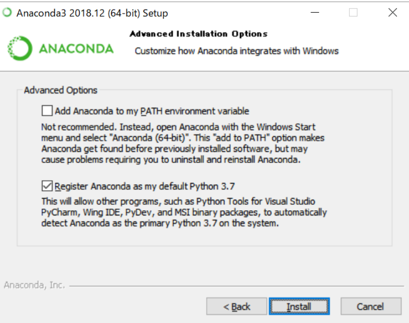

# 第３週：データサイエンスに求められる技能{#tools}


```{r setup_chap3, echo=FALSE}
knitr::opts_chunk$set(cache=TRUE)
```

## 分析ツールの必要性{#tools2}

簡単なデータの整理にはマイクロソフトの Excel に代表される表計算ソフトで十分に間に合うだろう。
しかし、一般にデータサイエンスでは扱うデータのサイズは大きいので、マウスで操作をするのは手間である。
また、Excel に備わっているデータ分析機能やグラフィックス作成機能は非常に貧弱である。

そこで表計算ソフト以外のツールに慣れる必要がある。データサイエンスやAIが広く活用されている現在、データ解析ツールには多数の選択肢がある。まず、有償のソフトウェアとしては、SPSS や SAS, MATLAB が有名である。

一方、無償で使えるツールとしては R や Python が世界的に普及している。
オンラインで利用できるツールとしては Google Colaboratory や Mirosoft AzureML, Tableau などがある。これらのオンラインツールは、無償の場合、いくらかの制約があるが、パソコンにインストールする必要がないので、とりあえず試してみることも可能である。

この授業では、データサイエンスの理論と手法について、より直感的に理解してもらうため、分析ツールを利用する。ツールを通して、実際にデータを操作してデータの要約やグラフィックス作成を行う。また、データについて仮説をたて、これを検証する手順についても、実際に行ってもらう。


## RとPython{#R_and_Python}

前節でも述べたように、サイズの大きなデータを扱うにはマウス操作はかえって不便である。
では、どうするかというと、 **プログラミング言語** を使うのである。
データサイエンス分野では、統計分析にフォーカスをおいたプログラミング言語があり、
中でも R と Python は広く使われている。

[R](https://www.r-project.org/){target=_blank} は統計分析とグラフィックス作成に特化したプログラミングツールである。最近では[RStudio](https://rstudio.com/){target=_blank} というIDE（プログラミングを使いやすくするための環境）と併用されることが多い。

一方、Python は汎用的な用途に利用できるプログラミング言語であるが、ここ数年、データ分析に焦点をあてたライブラリ（あとから追加できる拡張機能）が充実してきている。特に、ディープラーニング（深層学習）では、Python を使うことで、気軽に大規模データの解析ができる環境が整っている。

この講義では Python による演習を並行して行う。よって受講生は、各自、自身のパソコンに Python 環境を整えていただきたい。


## Python の導入{#python_install}


Python の導入方法には複数の方法がある。また利用している OS （WindowsかMacか、あるいはLinuxか）によっても異なる。

授業では、以下の環境がパソコンに導入されていることを前提とする。

1. Python のバージョン3.6 か 3.7 がインストールされていること 
2. ライブラリとして numpy, statsmodels, statistics, pandas, scipy,scikitlearn, matplotlib, seaborn が追加で導入されていること
3. 命令を書いたりグラフを表示させるためのツールとして jupyter が導入されていること（ただし、他のエディタになれているのであれば、jupyter は必要ない）

上記、1,2,3 の環境がすでに整っている、あるいは独自に設定することができる場合は、以下の導入に関する説明はスキップして構わない。


### もっとも簡単な方法{#simplest_way}

- [Anaconda](https://www.anaconda.com/){target=_blank} をインストールすることで、Python、データ分析追加ライブラリ、そしてjupyterの環境が整う。

Anacondaのトップページには Register （登録）というリンクがあるが、ユーザー登録の必要はない（もちろん、ユーザー登録をしても構わない）。

Windowsの場合は、サイトの右上にある Download リンク（2020年4月現在）から、Python3.7 のWindows用インストーラー (Anaconda3-2020*-Windows-x86_64.exeなどという名前) をダウンロードし(Downloadボタンを押す)、ダブルクリックするだけである（Graphical installerは必要ない）。
ただし、Windowsでは、途中、インストールタイプとして **All Users** を選ぶこと。


Just Me (recommended)を選ぶと、利用しているパソコンの設定によっては（例えば、ユーザー名に日本語を使っていると）、問題が生じる可能性がある。
逆に Mac では「個人環境向けにインストール」を選んだ方が良いだろう。

さらに、Windowsでは、「Add Anaconda to the system PATH environment variable」にはチェックを入れない。その下の、「Register Anaconda as the system Python」にチェックが入っていることを確認する。




最後に PyCharm のインストールを勧められるが、特に**必要ではない**。PyCharm は IDE と呼ばれるプログラミングの支援ソフトである。


なお、もう少し、細かく手順を知りたい場合は、Google で「Anaconda windows10 インストール」あるいは「Anaconda Mac インストール」で検索すればよいが、検索窓の下にある「ツール」から「期間指定」で「1年以内」を選ぶなどして、できるだけ新しい情報を探したほうが良いだろう。


## Jupyterの起動{#jupyter}

Windowのファイルメニューで [Anaconda]->[jupyter notebook]を選択。ブラウザの指定を求められたら、FirefoxやChrome、あるいはEdgeなどを選ぶ。


Macでは「アプリケーション」フォルダに Anaconda-Navigator がインストールされているので、これを起動し、Jupyter を launch する。


Jupyterを終了する場合は、ブラウザのJupyterの側で右上の Quit を押す。
あるいは起動と同時に出現するターミナル（コマンドプロンプト）という黒い画面上で Control キーを押しながらアルファベットのｃを押すことを二度繰り返す。


ブラウザ画面の右メニュー [New] から [Python3]を選択。

`import sys ` と入力し、改行してまた `sys.version` と入力する。ここで、ShiftキーをおしながらEnterを押すと、下に実行結果が表示されるはずである。


Jupyterの使い方については、以下のサイトなどを参照してほしい。

[外部サイト：図解！Jupyter Notebookを徹底解説！](https://ai-inter1.com/jupyter-notebook/){target=_blank}


## Pythonについて{#Python}


プログラミング言語は、大きくコンパイル系統とスクリプト系統に分かれる。
コンパイルとは、命令を書いたあと、これを機械語に変換することを意味する。
機械語は、普通の人には全く解読できなくなるが（ごく一部に、読む人はいる）、
コンピュータは機械語を理解し、命令を高速に実行できるようになる。命令を書いたファイル（ソースファイルなどという）を機械語に変えるには、
コンパイラというソフトが必要になる。C言語やJavaは、人間が書いたソースファイルをコンパイラにかけて機械語に翻訳したファイルが、コンピュータでは実行される。

一方、スクリプト系統では、命令を書いたファイルをそのままコンピュータで実行することができる。実行速度は機械語に劣るが、手軽に命令を試すことができる。
また、命令を書いたファイルをスクリプトと呼ぶ。PythonやPerl, Ruby、R はスクリプト系統のプログラミング言語である。

スクリプト言語は、コンパイル型の言語に比べて書きやすいと言われる。例えば、コンパイル型の言語で数値を扱う際、それが実数(real number,doubel, float)なのか、整数(integer)なのか、などの「型」を厳密に区別する。例えば、コンパイル系統のC言語では整数の2を整数として扱いたければ int x =2; 実数（浮動小数点型）であれば、double pi = 3.14159265359; や float pi = 3.14159265359f; のように代入を行う必要がある（代入については、以下の動画１で説明している）。

一方、スクリプト系統の言語では代入のときに「型」をそれほど意識する必要はない。X=2 とした場合、整数なのか、実数なのかは文脈（その命令の前後関係）で判断されることが多い。

以下の図ではC言語とPythonで `x` に 10 を代入し、3 で割った例を示す。


C言語では変数の型が重要であり、ここでは int 型（整数）を指定している。
このため 3 で割った結果も、整数のままである（小数点以下が表示されていない）。

これに対して Python では `x` に整数が代入された場合でも、処理（割り算）の結果を実数として表示している。


データサイエンスや人工知能の分野では、さまざまな言語が利用されている。
データ分析では、データの処理や演算に負荷がかかるため、主にコンパイラ系統の言語が利用されてきたが、PythonやRでバックグランドにC言語などで高速化したライブラリ（モジュール）が積極的に導入されるようになり、スクリプト言語でも高速かつ効率的な処理が可能になっている。
スクリプト言語であるPythonとRは、型の制約がゆるいなど、コードを書いて実行する一連の流れ（開発という）が簡素化されており、その意味で作業効率が非常に高い。また数値や統計処理に強いモジュールが豊富にあるだけでなく、WEBサイトなどの構築にも応用できる。また、オープンソースであり、OSが限定されず、無償で誰でも自由に使え、かつ商用目的での開発にも基本的には制約がない。このため、データサイエンス・AI分野でPythonとRの人気は非常に高く、世界中で広く使われている。


一般にプログラミング言語を学ぶ場合、その文法や構文などについて学ぶ必要がある。
Pythonについても、基本的な仕様を知っておくに越したことはない。
しかしながら、データサイエンスという分野に限れば、Pythonの言語仕様を全体として理解していなくとも、データサイエンス用のライブラリの使い方を習得しておくほうが重要である。

そこで、Pythonの言語仕様については、外部サイトで各自が自習しておくことを勧める。
インターネット上では、Pythonについての学習サイトが、動画を含めて多数公開されている。以下、その一例を紹介する。ただし、このサイトで学ばなければならないという意味ではない。受講生は、各自で自分にあったコンテンツを見つけて学んでほしい。


### 外部サイト{#Python_intro}

[文法編（ざっくり入門編＆がっつり文法編）](https://qiita.com/Fendo181/items/a934e4f94021115efb2e){target=_blank}

[文法編（ざっくり入門編＆がっつり文法編）](https://docs.python.org/ja/3/tutorial/index.html){target=_blank}

[実用編：シリーズになって選んで視聴できる【Python講座】第1回 開発環境構築【独り言】](https://www.youtube.com/watch?v=Wb3Ps-w-kko&list=PLzEbEpZ4njvOi0h8qf6faBR2qn3Co7SYr&index=1){target=_blank}


## jupyterの起動{#launch_jupyter}

Anacondaを使ってPythonをインストールすると、jupyter というプログラミングツールが同時に導入されている。

- Windows
ファイルメニューで [Anaconda]->[jupyter notebook]を選択。ブラウザの指定を求められることがあるが、FirefoxやChrome、あるいはEdgeなどを選ぶ。

- Mac
「アプリケーション」フォルダに Anaconda-Navigator がインストールされているので、これを起動し、画面からJupyterアイコンを探して launch する。


どちらの場合も、ブラウザが起動し、Jupyterの初期画面が表示される。

[以下の操作は動画１でも説明している（cアカウント, 例：c012345678@tokushima-u.ac.jp, でマイクロソフトのサービスにログインすると視聴できます）](https://web.microsoftstream.com/video/aed15923-3da7-4f92-9ad1-eb2aece95bbd){target=_blank}

<iframe width="640" height="360" src="https://web.microsoftstream.com/embed/video/aed15923-3da7-4f92-9ad1-eb2aece95bbd?autoplay=false&amp;showinfo=true" allowfullscreen style="border:none;"></iframe>

ここで、右メニューの **[New]** から **[Pytnon3]** を選択すると、新しいタブに新しいJupyterノートブックが開く。
この画面のグリーンで囲まれた領域を**セル**というが、ここに Python の命令を入力する。
ちなみに、プログラミング言語で命令のことを**コード**という。

ここで6つの数字からなるデータを入力してみよう（この数値には特に意味はない）。


## データ{#data_handling}

```
X = [11, 18, 14, 16, 15, 19]
X
```

左辺にアルファベット大文字で `X` 、イコール記号を挟んで右辺に鉤括弧の中に数値をカンマで区切って入力する。
これによって、`X` は6つの数値を保存したデータということが表現される。
あるいは `X` に**代入**する (assign) などと表現する。

また、Python では、複数の数値をまとめたデータを**リスト**という。
一般にプログラミング言語では、上の `X` を**オブジェクト**などとも表現する。
その他、統計用のプログラミング言語では、ベクトルや配列、あるいはシリーズという言い方もする。

では、このデータ `X` を操作してみよう。自分で数値のセットを代入したのだから、その要素の数は分かるわけだが、Pythonの命令（コード）を使って確認しよう。


```
len(X)
```

`len()` のように丸カッコがついたオブジェクトを**関数**(function)という。
len は長さ length の略である。関数 `len()` は、オブジェクト `X` の**長さ**を求めていることになるが、プログラミング言語では要素数を「長さ」とも表現するのである。

プログラミング言語では、関数名のあとに続く丸括弧内部に、データを指定する。この例では `X` を指定している。丸括弧に指定する対象を**引数**（ひきすう argument）ともいう。
つまり、上の実行例は、関数 `sum()` に引数として `X` を指定して実行した。

さて、次に `X` に含まれている数値の平均値を求めてみよう。平均値は、数値をすべて合計して、その個数で割れば良い。

そのために、まず `X` の要素の合計を計算する。これには、Pythonに備わっている関数 `sum()` を使う。


```
sum(X) 
```

平均値を求めるには、この合計を要素の数で割る。

```
sum(X) / len(X)
```

コンピュータでは、割り算はスラッシュで表現する。


## データサイエンスのためのライブラリ{#python_library}


さて、Python がデータサイエンスで広く使われる理由に、統計用の関数が整備されていることがあげられる。
例えば、いま平均値を求めるために、データの要素を合計し、個数で割るという命令を作成した。

Pythonの統計用のライブラリを導入すると、平均値を求める式を自分でコードとして書く必要はなくなる。

Pythonの統計用ライブラリとしては、**numpy** と **pandas** が有名である。
**numpy** も **pandas** も、Pythonというプログラミング言語にオリジナルの機能ではなく、Pythonのユーザーらが独自に開発して公開している拡張機能である。

よって、Pythonをインストールしたあと、ユーザーが自分で追加でインストールする必要がある。
ただし、この授業では Python を Anaconda というソフトウェアを使ってインストールすることを推奨しているが、
この場合、**numpy** も **pandas** も Python3 と同時にインストールされている。

実際に使ってみよう。


### numpy

まず **numpy** パッケージを使って、オブジェクト `X` を改めて作り直して、平均値を求めてみる。

[以下の操作は動画２でも説明している（cアカウント, 例：c012345678@tokushima-u.ac.jp, でマイクロソフトのサービスにログインすると視聴できます）](https://web.microsoftstream.com/video/0cc9a827-cd67-409b-b1e7-6722d120a535){target=_blank}

<iframe width="640" height="360" src="https://web.microsoftstream.com/embed/video/0cc9a827-cd67-409b-b1e7-6722d120a535?autoplay=false&amp;showinfo=true" allowfullscreen style="border:none;"></iframe>


```
import numpy as np
X = np.array([11, 18, 14, 16, 15, 19])
X
```

追加の拡張機能を利用する場合、Pythonでは `import` という命令を使う。
通常 **numnpy** の機能を使うためには、コードを書くたびに `numpy.` という文字列を入力する必要がある。
これに対して、コードの最初に `import numpy as np` と入力すると、以降、
**numpy** というライブラリの機能を使うためには `np.` という文字を先頭につければ済むことになり、
わずかではあるが入力の手間がへる。

この例では `np.array()` という関数で `X` という**配列**arrayを作成している。
すると、`X` という配列の後ろに `.mean()` を加えることで `X` の平均値を求めることができる。

```
X.mean()
```

ちなみに mean というのが英語で平均値のことである。平均値はデータを代表する値である。ただしデータを代表する数値は平均値だけではない。
他に中央値を median 、最瀕値を mode がある。詳細は第４回の講義で説明するが、英語の average は、これらの3つの代表値（それぞれmで始まる単語なので 3M などともいう）
のいずれかにあたる。


### pandas

**numpy** で実行したコードを **pandas** ライブラリで使って実行してみよう。

[以下の操作は動画３でも説明している（cアカウント, 例：c012345678@tokushima-u.ac.jp, でマイクロソフトのサービスにログインすると視聴できます）](https://web.microsoftstream.com/video/0cc9a827-cd67-409b-b1e7-6722d120a535){target=_blank}


<iframe width="640" height="360" src="https://web.microsoftstream.com/embed/video/ae789a0d-e713-4ff1-a20c-21124b188bc4?autoplay=false&amp;showinfo=true" allowfullscreen style="border:none;"></iframe>


```
import pandas as pd
X = pd.Series([11, 18, 14, 16, 15, 19])
X
```

**pandas** では、シリーズという名前でオブジェクト `X` を作成しているが、
**numpy** と異なり、数値が縦に表示されていることに注目してほしい。

（なお、Windowsでは黄色で警告メッセージが表示されるかもしれないが、ここでは無視して構わない）。

平均値を求める方法は **numpy** と同じである。

```
X.mean()
```


## データフレーム{#DataFrame}

データサイエンスのプログラミングで非常に重要な概念にデータフレームがある。
データフレームとは、Excelでいうシートに近いデータフォーマットであり、要するにデータを矩形、四角形にまとめたものである。


例えば、以下のようにデータフレームを作成できる。

```
dat = pd.DataFrame({'X': [11, 18, 14, 16, 15, 19],
                  'Y': ['A', 'A', 'B','B', 'C','C'],
				    'Z': [0.2, 0.8, 0.4, 0.6, 0.5, 0.9]})
dat
```

Excelのシートに似た形式のデータフォーマットになっている。
これを**データフレーム**という。このデータフレームには変数が3列ある。
データサイエンスにおいてデータを分析する場合、基本的にはデータをこのような形式に整える。
左端の 0 から始める連番は、データの行番号である（Pythonでは index というが、データの一部というわけではない）。
ほとんどのプログラミング言語では、行数や列数を表すのに 1 からではなく 0 から始まる。

現実には、Excelファイルやデータベースから必要なデータ（ファイル）を読み込む処理を行うことでデータフレームを作成することになるだろう。

平均値を求めてみよう。

```
dat.mean()
```

`mean()` を使うと `X` 列と `Z` 列の数値は平均が求められているが `Y` 列は無視されている。
これは`Y`列の中身が文字であることから、平均値を求めるという処理に意味がないからである。

ただ、平均値を求める場合、あるグループごとに求めたいという場合がある。例えば男女別に身長の平均値を求める場合である。

`dat` データで `Y` 列の水準（ここでは "A","B","C"）ごとにグループ化して平均値を求めてみよう。


```
dat.groupby('Y').mean()
```

`groupby()` という関数で、データを `Y` 列の水準ごとにグループ化し、それぞれの平均値を別々に求めることができる。


## グラフィックス{#matplotlib}

次に、データ操作とグラフ作成の例を紹介しよう。
**seaborn** というパッケージには `titanic` というデータがある。
これは、大西洋を航行中の1912年4月15日の早朝、氷山と衝突して沈没した豪華客船の乗客のデータであり、乗客の名前、性別、年齢、船室の等級などに加え、その乗客の生存に関する情報が含まれている。


```
%matplotlib inline
import matplotlib.pyplot as plt
import seaborn as sns
titanic = sns.load_dataset('titanic')
```

最初の３行は、Pythonのデータ分析で標準的なデータ作成ツールを利用することを宣言している。
４行目が、**seaborn** というデータ作成ライブラリに含まれているタイタニック号のデータを呼び出すコードである。


データの概要を見てみよう。

```
titanic.info()
```

ここに並んでいるのは、列名とその内容（数値変数なのかカテゴリ変数なのか）、そして入力された個数である。
数値が統一されていないのは、列（変数）によっては欠損値(NA)が含まれているからである。


`titanic` データの行数と列数を確認しよう。

```
titanic.shape
```

ちなみに、`shape` は関数ではなく、属性(propertyあるいはattribute)と呼ばれる要素なので、丸括弧をつけない。

実際のタイタニック号には、二千人を超える乗客がいたそうだが、このデータには800人程度のサブセットとなっている。
さて、これらの乗客の生存者数を確認してみよう。


```
titanic['survived'].value_counts()
```

データフレームの列名を特定するのに、オブジェクト名(`titanic`)の後ろにカギかっこをおいて、引用符(single quotation)で列名を指定する。
その後ろに `` という関数をつながると、指定されたカテゴリ変数の水準(level)の個数が表示される。
ここで 0 は死亡を、1は生存に対応する。

年齢のヒストグラムを作成してみよう。

```
titanic['age'].hist()
```

ヒストグラムについては、講義の第5回で説明予定だが、要するに、年齢区分ごとに該当する乗客が何人いるかを棒グラフで表現したものである。

今度は、性別ごとの人数を確認してみよう。

```
sns.countplot('sex', data=titanic, palette='rainbow')
```

船室の等級別の人数を確認しよう。

```
sns.countplot('pclass', data=titanic, palette='rainbow')
```

船室の等級と、年齢の関係を見てみよう。

```
sns.factorplot(x='pclass',y='age', hue='sex', data=titanic, palette='pastel')
plt.show()
```

生存者数と性別の関係を棒グラフで確認してみよう。

```
sns.countplot('survived', data=titanic, hue='sex', palette='rainbow')
```

さて、船室の等級と性別、そして生存割合を確認してみよう。


```
titanic.pivot_table(index="pclass", columns= "sex", values="survived")
```

`pivot_table()` は**分割表**（クロステーブルcontingency table)を作成する命令である。
分割表とは、行と列それぞれに変数を対応させ、その人数（個数）をまとめた表である。

|                  | 賛成  | 反対  |
|------------------|-------|-------|
| 年齢層 20 歳未満 | 10 人 | 1 人  |
| 年齢層 30 歳まで | 15 人 | 3 人  |
| 年齢層 40 歳まで | 25 人 | 35 人 |
| 年齢層 50 歳以上 | 30 人 | 12 人 |
|------------------|-------|-------|


タイタニック号は、生存者が、性別、年齢、そして船室の等級でかなり異なることが知られているデータである。
簡単に言うと、性別が女性でそして、年齢が若い、つまり子供の場合、その多くが生存している。逆に、男性で年齢が上の場合、その多くが死亡している。
ここから、乗船客の成人男性が、自らの命と引き換えに、女性や子供を率先して助けたことが見て取れるデータである。

タイタニック号データは、この講義の統計モデリングの週で、もう少し詳しく分析する予定である。

最後に、Jupyterに入力したデータを保存しておこう。
その前に、デフォルトのフォルダを確認しておこう。

```
import os
os.getwdc()
```

表示されたフォルダにJupyterのノートは保存される。Jupyterノートブックの左ロゴの隣にある Untilted を DataScience などと変更したうえで、保存ボタンを押せば良い。
なお、次回 Jupyter を起動すると、最初の画面のファイルとフォルダの一覧に、今回作成した Jupyter Notebook が DataScience.ipynbとして表示されているはずである。
これをクリックすれば、前回の続きから入力できるようになる。

Jupyter画面の右上にある logout を押す。

また、別のウィンドウ（ターミナルコマンドプロンプト）上で、Control を押しながらアルファベットの C を2回続けて押すことで Jupyter が完全に終了する。


Jupyter Notebookの使い方は、例えば以下のサイトなどを参照されたい。

[データ分析で欠かせない！Jupyter Notebookの使い方【初心者向け】](https://techacademy.jp/magazine/17430){target=_blank}

