# Kaggle{#start_kaggle}


```{r setup_chap10, echo=FALSE}
# knitr::opts_chunk$set(cache=FALSE)
library(reticulate)
matplotlib <- import("matplotlib", convert = TRUE)
matplotlib$use("Agg")
```

これから各自でKaggle Titanicデータの分析に挑戦してもらう。

[外部サイト：Kaggle Titanic](https://www.kaggle.com/c/titanic){target=_blank}

一通り作業を終えて、Kaggleにコミットするまで作業し、そのカーネル（あとで説明する）のURLを小テストして投稿することで、第10回授業に出席したものとみなす。

なお、以下の説明サンプルは、石田のKaggleアカウントの公開カーネルとして参照できる。


[外部サイト：Kaggleカーネルの例](https://www.kaggle.com/motohiro/kernel726d228659){target=_blank}

ちなみに、説明サンプルでは単純なロジスティック回帰を実行しているが、受講者自身の判断で、別の分析手法に変えても構わない。特徴量についても、独自に加工ないし編集、追加して構わない。

## 登録{#regsiter}

https://www.kaggle.com/ にアクセスし、ユーザー登録をする。大学メールアドレスでなくともよいが、Kaggleからの通知を確実に受信できるアドレスにしておくこと。携帯キャリアのメールアドレスは避けたほうがいいだろう。

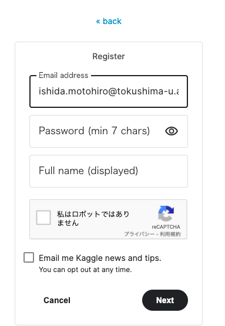


## login{#login}


```{python read_titanic_train_data, echo =FALSE}
import pandas as pd
import numpy as np
train = pd.read_csv('data/train.csv')
```


まずKaggleにログインしよう。

\  


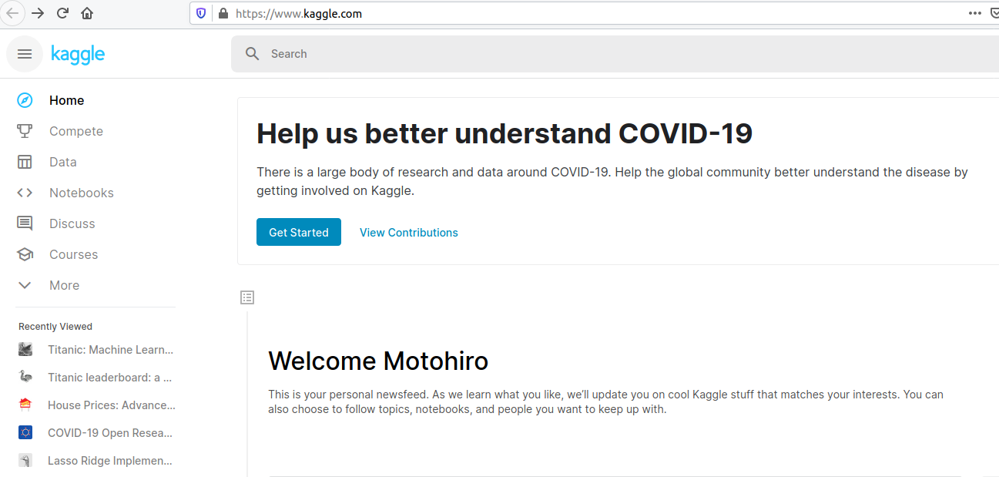

\  

左のメニューでCompete をクリックすると、コンペ一覧が表示される。

\  

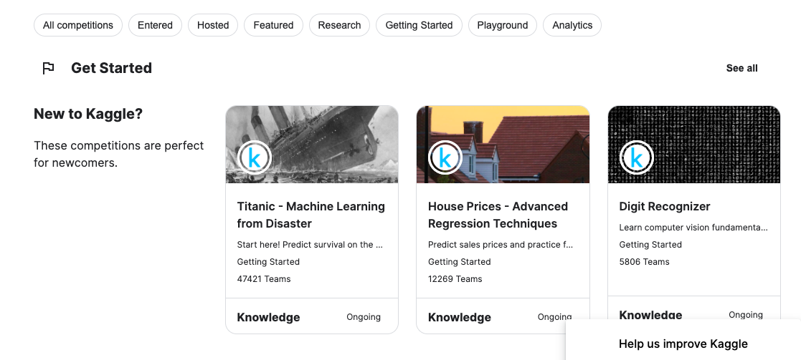

\  


上に並んでいる All Competitions や Entered などはカテゴリを表す。
ここでは Getting Started を選ぶ（登録したばかりにユーザーの場合、上の画像にあるように、すでにGet Started として表示されている）。


初心者向けの Competetions  一覧が表示されるので、ここからTitanicを選択。


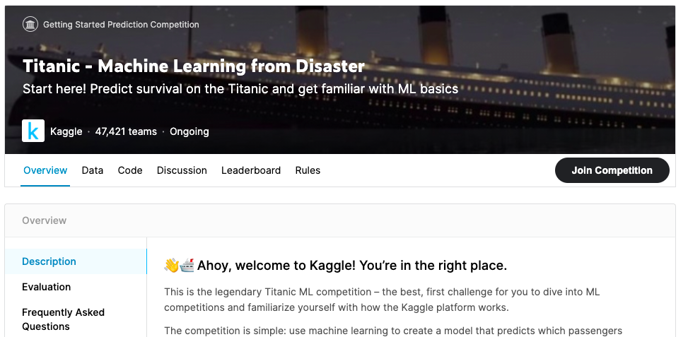

<!-- 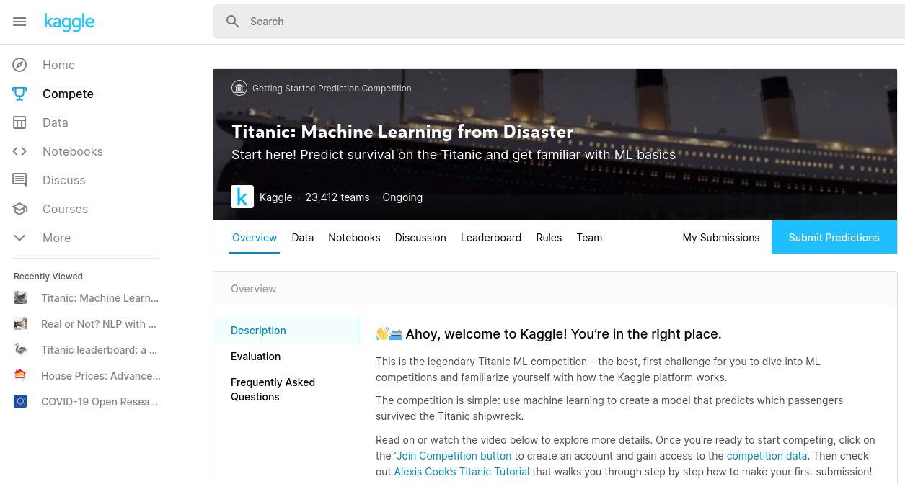 -->

まず、このページ Overview の解説をざっと眺めよう。

タブメニューに Data Notebooks Discussion Learderboard Rules Teamとあるので、ざっと解説する。
なお、Rulesタブにアクセスし、[I understand and Accept]をクリックしておく。

## Data

ここでコンペのデータをダウンロードできるようになっている。ただし、あとで紹介するNotebooksを使う場合、データをダウンロードする必要はない。


またデータは３種類ある。 

- gender_submission.csv
- test.csv
- train.csv

train.csvは、訓練用のデータであり、このファイルで機械学習のモデルを作成する。そのうえで、 test.csv を使って予測する。 test.csv にはラベル（応答変数）が含まれていない。予測結果は gender_submission.csv ファイルに追記する形で投稿する。

## Notebooks

PythonあるいはRを使って実際にデータを分析するための作業ページ。世界中のユーザーの作業内容も見ることができる（Publicタブ）。
他のユーザーの作業コードをコピーして、自分でカスタマイズすることもできる（ユーザーを選び、Copy&editを押す）。
YourWorkタブは、自分の作業コードが保存されている。


## その他{#etc}

Discussionはデータについての議論、Rules はデータ分析上のルール。特に賞金付きのコンペに挑戦する場合は、注意深く読んでおく必要がある。
Leaderboardは順位である。ただし、ここにはPublic Leaderboardと、Private Leaderboardの２種類がある。
Public Leaderboardには、さまざまなユーザーが、訓練データを学習して、訓練データの説明変数から予測を行い、その結果を訓練データの答え（応答変数）と照合した結果にもとづく順位が表示される。
Kaggleの最終成績はテストデータから予測した結果で評価されるので、Public Leaderboardは成績ではない。
Kaggleでの最終成績は、Private Leaderboardに表示される。これはテストデータを予測した結果が、Kaggleの側だけが知っている回答と照合されて表示される。


## Notebooksを作成する{#start_Notebooks}

NotebooksのYourWorkタブをクリックし Create New Notebook をクリックする。

\  


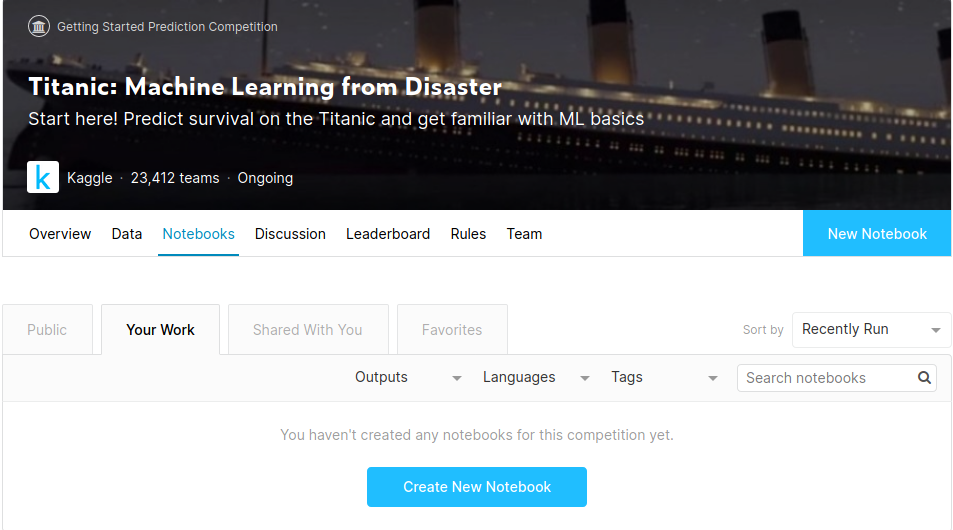


\  

デフォルト設定のまま Createを押す

\  

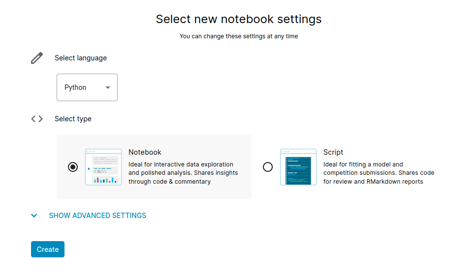

\  


Kernel（KaggleのWEB上に作成されるNotebookをカーネルと呼ぶ）が生成されるのを待つ。


用意されたファイルの先頭にあるのはデフォルト設定である。セルにカーソルを表すと、左上に▶が現れるので、クリックする。

\  


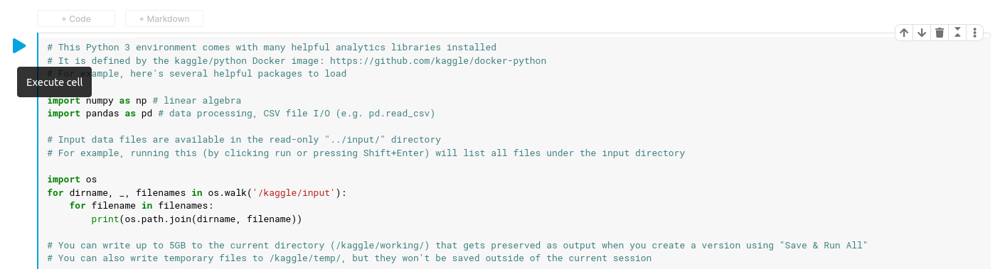


\  


すると、すぐ下に実行結果が表示されたはずだ。実行されたのは、カーネルでアクセス可能なファイル名の一覧である。

\  

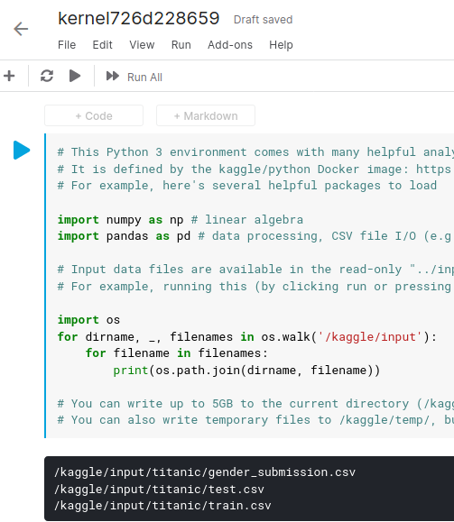

\  

訓練データを読み込んでみよう。以下のように入力して▶を押すか、あるいはショートカットキーである Shift+Enterを押す。

\  

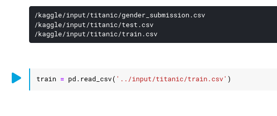

\  


ちなみに、引用符の中は、「一つ上にディレクトリ（フォルダ）に戻り、その下にあるinputディレクトリの下にあるtitatnicディレクトリにあるtrain.scvファイルを読み込むという意味である。これで `train` と名前でTitanic号のデータが読み込まれた。


## 特徴量の確認{#feature_enginerring}

さて、読み込まれたデータを確認しよう。実行したセルの下に ＋Code +Markdownと表示されているが、ここでコメントを入れてみよう。+Markdownを選ぶ。
 
\  
 
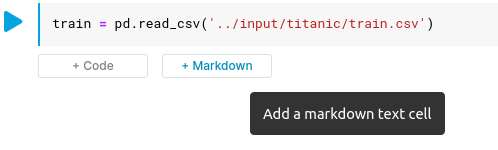


\  


Markdownとは、ファイルの段落などを管理する記述方法で、現在、さまざまな分野で導入が進んでいる。

[外部サイト：Markdown：Markdownとは](https://www.markdown.jp/what-is-markdown/){target=_blank}


「## 特徴量を確認」などと入力する。ちなみにMarkdownでは見出し語を ＃の数で調整する。

\  
 
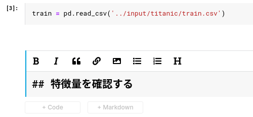

\  

＋Codeを押す。

`train.describe` と入力して実行

\  

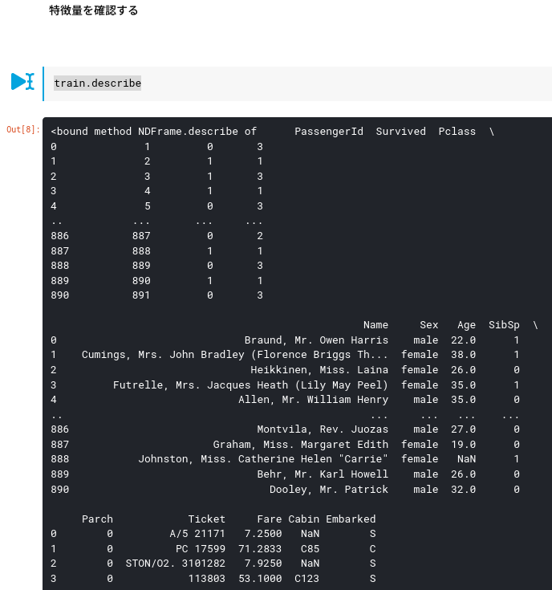

\  

また、数値で記録されている変数の相関(correlation)を確認しよう。


```{python corr_titanic}
train.corr()
```

PClassとFareの間には、かなり強い負の相関がある。SibSPとParchの相関も高い。


PassengerId  Survived  Pclass  Name     Sex   Age  SibSp Parch            Ticket     Fare Cabin Embarked 
の12列と、最初と最後の行が確認できるだろう。 Survived がコンペの応答変数で１が生存を、０が死亡を表す。

最初に、乗客の識別ID、名前が「生死」の予測に使えるかどうかを考えよう。常識的には使えなさそうである。
乗船クラス階級（Pclass）と性別（Sex）、年齢（Age）はどうだろうか？これは関係ありそうだ。
SibSp は該当の乗客が兄弟姉妹とともに乗船していたならば、その人数が、Parchは同じく親あるいは子供が同時に乗船した場合、その人数が記録されている。 
チケットは乗船区画の種類だが、これはクラス階級に近い情報だろう。またCabinは船室の番号であるが、生存には直接関係なさそうである（クラス階級があれば十分そうである）。
Embarkedは乗船した港の名前である。

とりあえず PassengerId  Name Ticket Cabin は説明変数として使う必要はなさそうである。
SibSp Parch  Embarked はどうだろうか？生存と、これらの変数の関係を可視化してみよう。


SibSpと生存の関係を確認しよう。

```{python sibs_Survived, eval = FALSE}
import matplotlib.pyplot as plt
import seaborn as sns
sns.countplot(x = 'SibSp', hue = "Survived", data = train)
plt.legend(loc = "upper right", title = "Survived ~ Sibsp")
```

\  

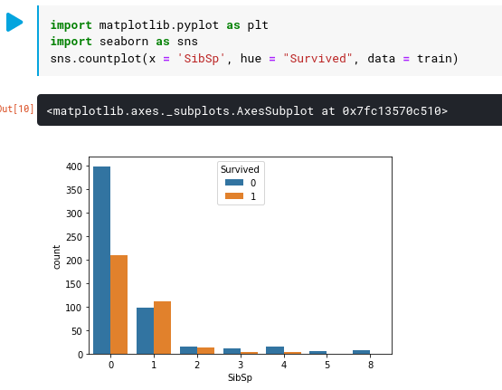

\  


兄弟姉妹が同乗していない場合、死亡率が高いのが確認できる（同じようにParch と Embarked を確認しよう）。
どうやら家族が同乗しているかどうかは、当人の生存に非常に影響があることが分かる。

運賃はどうだろうか。
Fare は運賃であり、カテゴリ変数ではないので、ヒストグラムを使って生存との関係を見てみよう。

```{python import_gprah_library, echo=FALSE}
import matplotlib.pyplot as plt
import seaborn as sns
```

```{python titanic_hist}
sns.distplot(train[train['Survived'] == 0].Fare, kde=False,rug=False)
sns.distplot(train[train['Survived'] == 1].Fare,  kde=False,rug=False)
```

```{python titanic_hist_show, echo=FALSE}
plt.show()
```

青が死亡者であるが、運賃の低い乗船客の死亡率が高いことが分かる。FareはPClassとの相関が高いので、一方があれば十分かもしれない。
特に回帰モデルでは、相関の高い変数を同時にモデルに投入すると多重強線性（たじゅうきょうせんせい：multicollinearity）という問題が起こり、結果が安定しない。

### 欠損値の処理{#missing_value}

ここでデータに欠損値(missing values)が含まれるかを確認する。

```{python titanic_isnull}
train.isnull().sum()
```

AgeとCabinに欠損値が多い。Cabinは特徴量として利用しないとして、Ageは重要な情報でもあるので残したいが、多くの統計ソフトでは、欠損値を含むレコード（行）は、たとえ他の変数が記録されていても、まるごと削除されてしまうことがある。
そこで、Ageを補間（ほかん：interpolation）する。欠損値の補間をする最良の方法は、完全情報最尤法(かんぜんじょうほうさいゆうほう：full information maximum likelihood)とされるが、ここでは簡単のため、`fillna()` を使って欠損値をAgeの中央値でうめよう。また Embarkedの欠損値は、S とする。

まず、説明変数として利用する予定のない変数をデータから削除し、その上で欠損値を処理する。


```{python titanic_remove_vars}
train.drop(['PassengerId','Name','Cabin','Ticket', ], axis=1, inplace=True)
train["Age"].fillna(train["Age"].median(skipna=True), inplace=True)
train["Embarked"].fillna(train['Embarked'].value_counts().idxmax(), inplace=True)
```

### SibSPとParch{#parch}

さて、ここで、分析の観点から、データに新しい特徴量を追加する。

SibSPとParchは、前者は兄弟姉妹、後者は親子供の数を表す変数であり、生存との関係が強い。が、この2つは相関も高かったのだが、
いずれも0人（つまり一人の旅行）だった場合、死亡率が高くなるようである。そこで、2つの変数の合算値が0かそれ以上かを表す変数`Alone`を新たに用意しよう。


```{python titanic_alone}
train['Alone']=np.where((train["SibSp"]+train["Parch"])>0, 0, 1)
train.drop(['SibSp', 'Parch'], axis=1, inplace=True)
```


## ダミー変数の作成{#Dummy_variables}


さて、次に、データの Embarked,Sexは文字列として登録されている。
またPclassは数字が入力されているが、１は1等、2は2等、3は3等なのだが、機械学習では整数として 1よりも3が大きい（上の等級である）として処理されてしまう。

これら3つの変数をダミー化する。ただし、第7回の講義コンテンツで説明したように、カテゴリ変数をダミー化した場合、どれか1つの水準を参照水準とする。
つまり、参照水準はデータから削除する。

`get_dummies()`を使うが、試しにSexをダミー化してみよう。


\__


```{python makeDummieSex, eval=FALSE}
pd.get_dummies(train['Sex'])
```

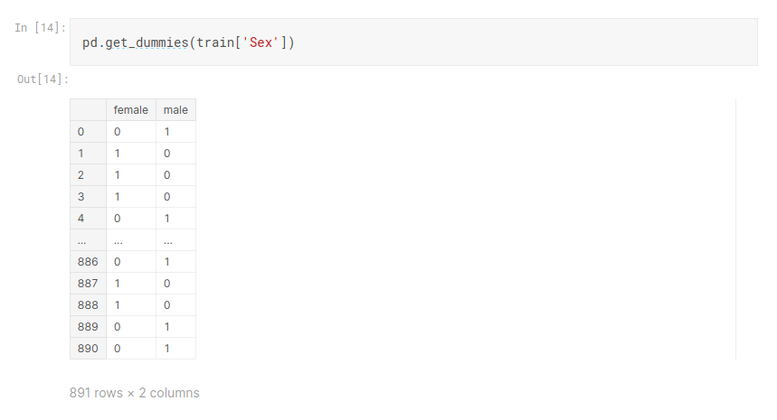


実際にダミー化を行う。その際、最初の水準を削除する。

\__

```{python makeTraining, eval=FALSE}
training = pd.get_dummies(train, columns=["Pclass","Embarked","Sex"], drop_first=True)
training
```


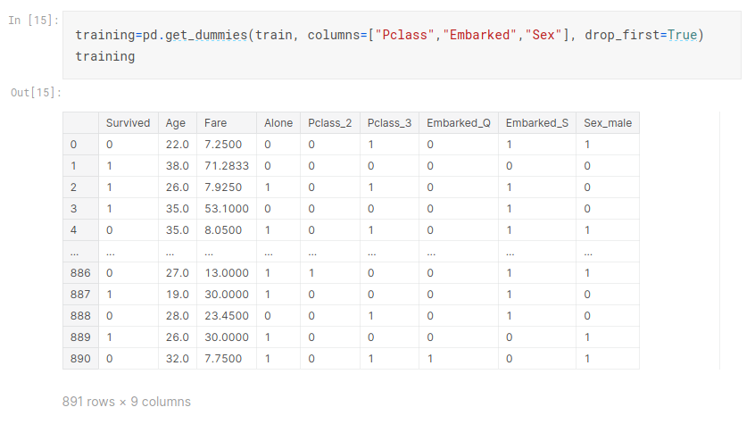


### AgeとFare{#AGE_Fare}

次に、AgeとFareは標準化しておこう。つまり平均値が0で標準偏差を1とする。
なお、標準化を行う場合、データ本体の作業コピーを取り、このコピーに処理した結果で、もとデータを置き換える。


```{python titanicStandardScaler, eval=FALSE}
from sklearn.preprocessing import StandardScaler
train_standard = StandardScaler()
train_copied = training.copy()
train_standard.fit(train_copied[['Age','Fare']])
train_std = pd.DataFrame(train_standard.transform(train_copied[['Age','Fare']]))
train_std
```

```{python titanicAgeFare, eval=FALSE}
training[['Age','Fare'] ] = train_std
training
```

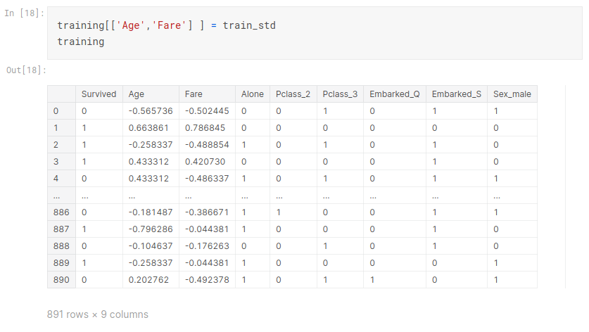


## モデルの適用{#modeling_kaggle}

それでは単純なロジスティクス回帰モデルを当てはめてみよう。


```{python titanic_fit_logistcs, eval =FALSE}
from sklearn.linear_model import LogisticRegression
cols = ["Age","Fare","Alone","Pclass_2","Pclass_2","Embarked_Q","Embarked_S","Sex_male"] 
X = training[cols]
y = training['Survived']
# Build a logreg and compute the feature importances
model = LogisticRegression()
# create the RFE model and select 8 attributes
model.fit(X,y)
```

学習モデルを使って、学習データを予測してみる。


```{python eval_titanic_train_Data, eval =FALSE}
from sklearn.metrics import accuracy_score
train_predicted = model.predict(X)
accuracy_score(train_predicted, y)
```


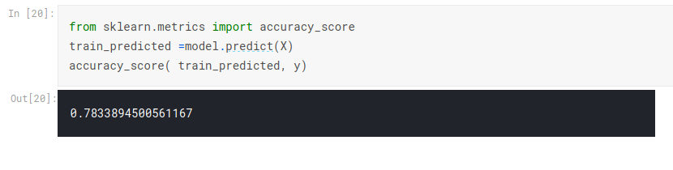


### テストデータを読む{#read_titanic_test_data}


つぎにテストデータを予測するが、まずテストデータを、訓練データと同じように整形しなければならない。
訓練データに対する処理をテストデータに対しても繰り返せばよい。ただし、Ageの欠損値は、訓練データのAgeの中央値28を直接指定する。
また、標準化は、訓練データに適用した結果を利用する
（なお、最初に訓練データとテストデータを統合し、その統合データで標準化すべきだという意見もあることを注記しておく）。


まず Kaggle で用意されているテストデータを読み込む。

\__


```{python read_test_csv, echo=FALSE}
import pandas as pd
test = pd.read_csv('data/test.csv')
```


```{python read_titanic_test_data, eval=FALSE}
test = pd.read_csv('../input/titanic/test.csv')
```


再びデータに欠損値(missing values)が含まれるかを確認する。

```{python titanic_test_data_is_null, eval=FALSE}
test.isnull().sum()
```

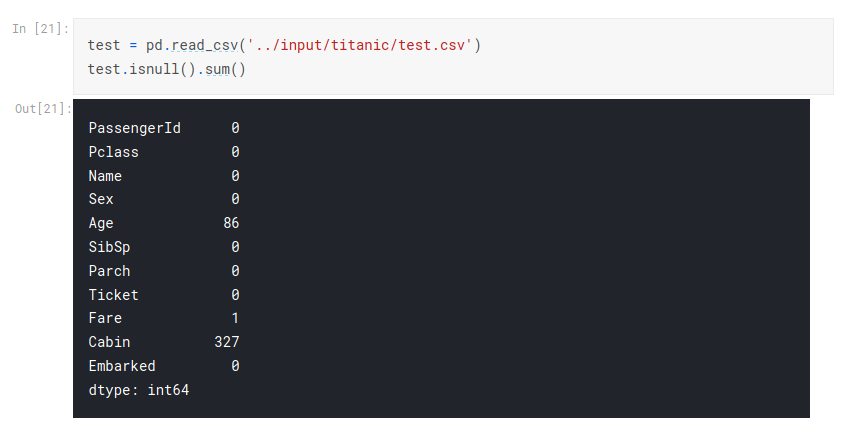


ここでFareに欠損値があるが、これは訓練データにはなかった。
そこで、Fareを訓練データの中央値で補間する処理を加える。
すでに述べたように、Ageの欠損値は、訓練データのAgeの中央値28を直接指定する。
また、標準化は、訓練データに適用した結果を利用する。この際、テストデータのコピーを用意し、標準化の結果をもとのテストデータに反映させる。


```{python prepare_titanic_test_Data, eval =FALSE}
test.drop(['PassengerId','Name','Cabin','Ticket'], axis=1, inplace=True)
test["Age"].fillna(28, inplace=True)
test["Embarked"].fillna(test['Embarked'].value_counts().idxmax(), inplace=True)
test["Fare"].fillna(train.Fare.median(), inplace=True)
test['Alone']=np.where((test["SibSp"]+test["Parch"])>0, 0, 1)
test.drop(['SibSp', 'Parch'], axis=1, inplace=True)
testing=pd.get_dummies(test, columns=["Pclass","Embarked","Sex"], drop_first=True)
print(testing.dtypes)
test_copied = testing.copy()
test_std = train_standard.transform(test_copied[['Age','Fare']])
test_std
testing[['Age','Fare']] = test_std
testing
```

<!--
test.drop(['PassengerId','Name','Cabin','Ticket', ], axis=1, inplace=True)
test["Age"].fillna(28.0, inplace=True)
test["Embarked"].fillna(test['Embarked'].value_counts().idxmax(), inplace=True)
test['Alone']=np.where((test["SibSp"]+test["Parch"])>0, 0, 1)
test.drop(['SibSp', 'Parch'], axis=1, inplace=True)
testing=pd.get_dummies(test, columns=["Pclass","Embarked","Sex"], drop_first=True)
test_copied = testing.copy()
test_std = train_standard.transform(test_copied[['Age','Fare']])
testing[['Age','Fare']] = test_std
-->

準備ができたので、テストデータを予測する。


```{python titanic_eval_test_data, eval=FALSE}
cols = ["Age","Fare","Alone","Pclass_2","Pclass_2","Embarked_Q","Embarked_S","Sex_male"] 
X_test=testing[cols]
print(X_test.dtypes)
test_predicted = model.predict(X_test)
```

テストデータの応答変数(Survived)は与えられていない。これはテストデータの予測結果をKaggleに提出すると表示される。


### 予測結果をコミット{#commit_predict}

予測結果をファイルに保存してコミットする準備を行う。


```{python read_gender_submission_kaggle, eval=FALSE}
sub = pd.read_csv('../input/titanic/gender_submission.csv')
```

予測結果を回答ファイルに追記し、新規ファイルとして保存する。

```{python write_submission_csv_kaggle, eval=FALSE}
sub['Survived'] = list(map(int, test_predicted))
sub.to_csv('submission.csv', index=False)
```

右上の[Share]をクリックし、[Public]に変更する。全公開するかと尋ねられるので [OK make public]を選ぶ。

\  


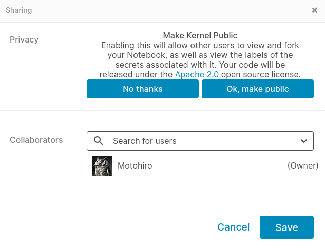

\  

右上の[Save Version]をクリックし、[Save&Run all] を選択して[Save]を押す。

しばらく待つと、すべてのコードが実行され、右に [Output] が現れる。クリックすると、テストデータを予測した結果が表示されるので、
[submit]を押す。
以下のような画面が出て、右にテストデータの予測精度が表示される。


\  

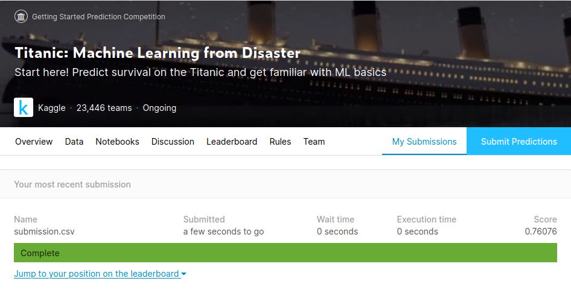


\  

Jump to your position on the leaderboard のリンクを押すと、自分の順位が表示される。

\  

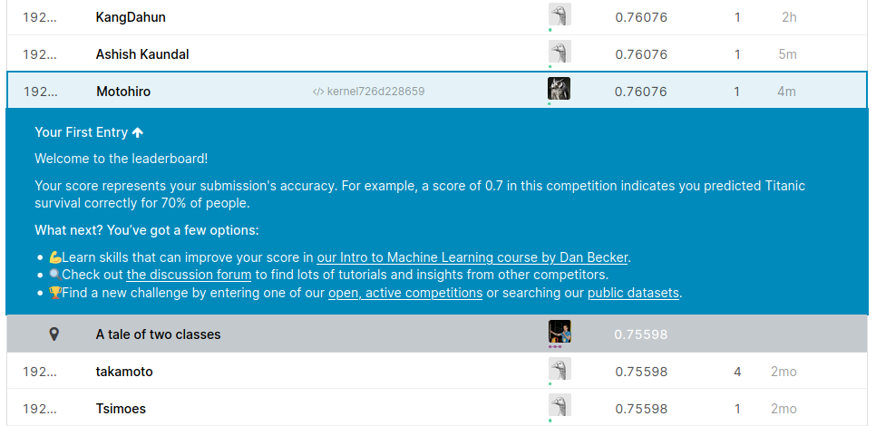

\  

<!--


[](){target=_blank}


-->


## 以上の操作の動画{#movies}

その１　欠損値の処理まで

Microsoft Stream


<iframe width="640" height="360" src="https://web.microsoftstream.com/embed/video/1d0a4904-80f5-4317-9bb7-8ab164fbe841?autoplay=false&amp;showinfo=true" allowfullscreen style="border:none;"></iframe>

\__

同じ動画：Youtube

<iframe width="560" height="315" src="https://www.youtube.com/embed/3SKjw8teTWM" frameborder="0" allow="accelerometer; autoplay; encrypted-media; gyroscope; picture-in-picture" allowfullscreen></iframe>

\__

\__

その２ Kaggleへのサブミッションまで

\__

Microsoft Stream


<iframe width="640" height="360" src="https://web.microsoftstream.com/embed/video/41e4bd1a-72cb-405c-af7a-fb123a07b459?autoplay=false&amp;showinfo=true" allowfullscreen style="border:none;"></iframe>

\__

同じ動画：Youtube

<iframe width="560" height="315" src="https://www.youtube.com/embed/UrfJq5uJ1mA" frameborder="0" allow="accelerometer; autoplay; encrypted-media; gyroscope; picture-in-picture" allowfullscreen></iframe>

## Teamの結成方法{#Teams}

班で、課題（コンペティション）を決めたら、まず班の全員がそのコンペのページで Rules に同意しておく(Rulesタブで[I Understand and Accept]をクリックする)。次に、班のリーダが、自分のKaggleダッシュボードのコンペページで、右上のTeam タブをクリック。
チーム名を設定の上、その下の Merge with other teams or invite users to your team by their team name の下に、自分の班のメンバーのアカウント名を入力し、Request Merge ボタンを押す。すると、そのメンバーに招待状が届くので、これをacceptする。


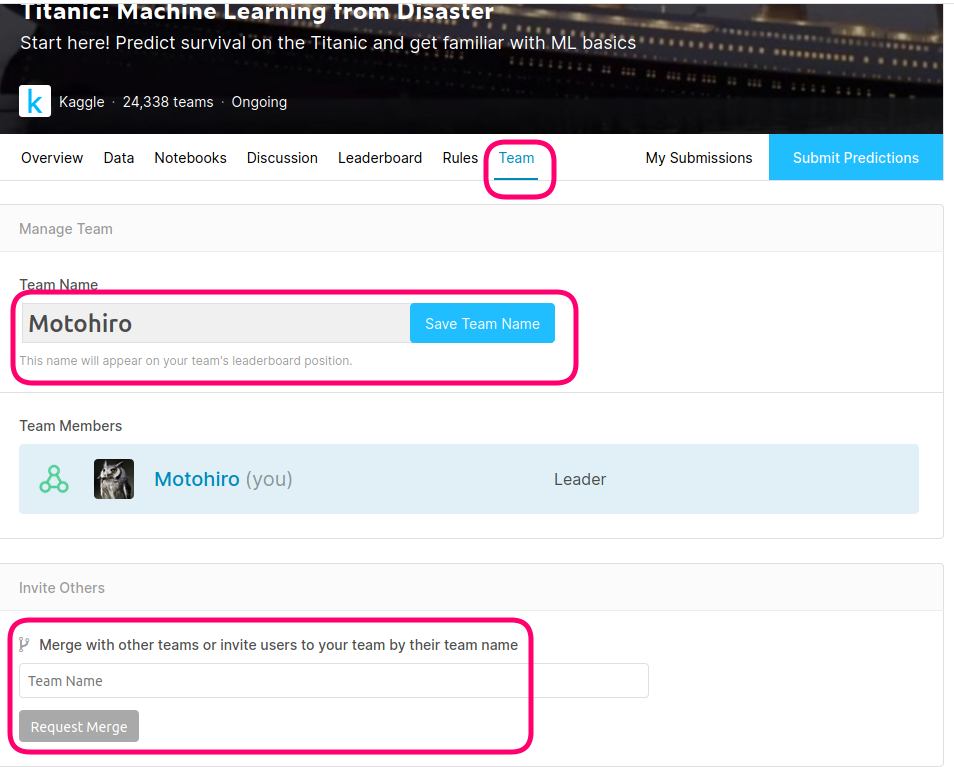

　コンペによってはチームに参加できる人数、あるいはチーム結成ができないことがあるが、課題として選択するのに支障はない。

　特にチーム結成ができないコンペでは、班のメンバそれぞれが課題コンペに[参加]し、班の分析方針に従ってカーネルを操作してみること。ただし、提出するプレゼンテーション資料への記載については、班メンバ誰か一人のカーネルURLを提示すれば良い。
　
役割分担については、詳細に記すこと。


分析手法によっては、提出プレゼン資料要件5の[仮説]、6の[説明変数選択]について説明しにくいかもしれないが、その場合は、「仮説に該当する考え方」、「選択手法において何が特徴量となっているのか」などについて説明すること。特に、深層学習の手法を使う場合は、その仕組みについて、6の[説明変数選択]のスライドに説明すること（この説明は、教員向けというよりは、班のメンバ全員が手法の意味を共有することが目的である）。


たとえば、画像データに深層学習を適用する場合、画像をどのように入力データに変換するのか、あるいは入力データに非線形の変換がなされることになるが、その変換は何を意味しているのか、などの説明ができるはずである。

重要なのは、班のメンバ全員が、適用した手法の目的と意味を共有できていることである。当該スライドの執筆担当者は、他の班メンバに説明するつもりで丁寧に書いてください。

