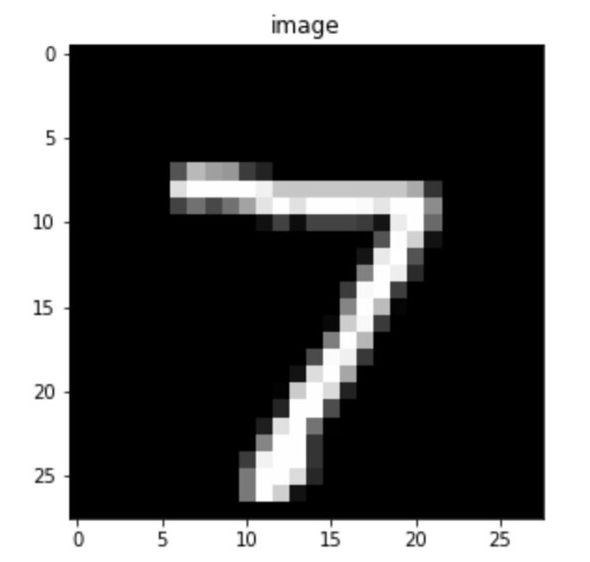
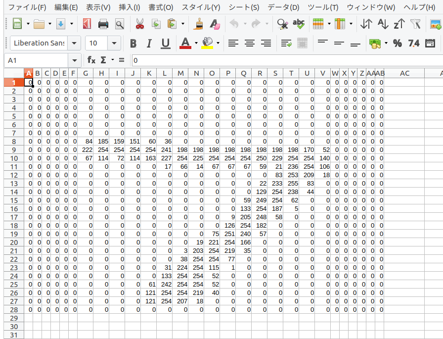
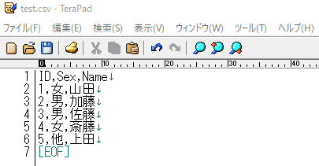
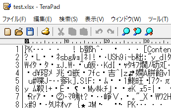
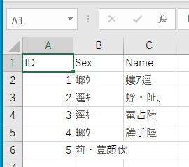
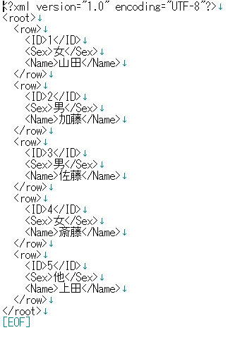
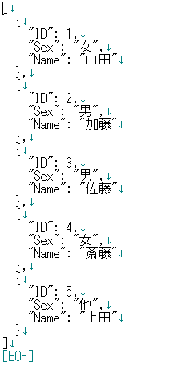

# 第２週：その１ データサイエンスに必要な知識{#requisite}

## データとは{#what_data}

我々は日常、データという言葉をよく見聞きする。日常語としてのデータの意味は広い。
例えば、いくつかの国語辞典で引くと、「推論の根拠となる事実、資料」という趣旨の解説がなされている。
用例.jpで「データ」を検索してみると、次のような文例に遭遇する。

[外部サイト：用例ｊｐ](http://yourei.jp){target="_blank"}

> 「先蔵爺さんのデータには「家族」欄にゆきの名と性格が記入されていた。

菊地秀行『トレジャー・ハンター01 エイリアン秘宝街』より引用」

>「ビジネスの世界も同様だ。管理職になると、月に二十回から三十回以上の会議に参加しなければならないというデータもある。」

塩田丸男『口下手は損ですか 面白い話をするための12章』より引用」
>

この用例では、データは「記憶」や「情報」という程度の意味で使われている。また、ある電子辞書の広告には以下のような書かれていた。
[外部サイト：シャープ社Papyrus](https://jp.sharp/papyrus/lineup/pw-at750/contents.html){target="_blank"}

> 「逆引きスーパー大辞林と5種類〈人名､地名､作品名､季語､慣用句〉の、｢分野別小辞典｣は､スーパー大辞林のデータを元に編集された電子版の辞書機能であり、書籍版は刊行されておりません。」
> 
> 三省堂監修 「逆引きスーパー大辞林」「5種類の分野別小辞典」
>

この文脈では、「データ」をコピー元（オリジナルの辞書）の原稿という意味合いで用いているようである。

一方、データサイエンスでは、データをもう少し狭い意味で考える。つまり、データを厳密に考える。
例えば、先の引用で「管理職になると、月に二十回から三十回以上の会議に参加しなければならない」とあるが、これは恐らく「聞いた話」あるいは「噂話」のことだろう。

この発言を、データサイエンティスト（データサイエンスの専門家）の立場で考えるとする。たとえば、授業担当者である石田は、この発言の前提として、以下を考えたくなる。

1. 管理職とそれ以外の社員の区別が明確になされている
2. 管理職とそれ以外の社員のそれぞれ全員、あるいは無作為に選ばれた標本（標本については後述）について、参加する会議の回数が少なくとも1ヶ月分は記録されている
3. 管理職が毎月参加する会議の数が20回以上となる確率を求められる
4. 一般の社員が毎月参加する会議の数が20回以下となる確率を求められる

面倒なように思われるかも知れないが、上記4つの条件（もっと細かく条件をあげるデータサイエンティストもいるだろう）が揃っていなければ、データサイエンティストとしての（石田）の立場からは、「管理職になると、月に二十回から三十回以上の会議に参加しなければならない」とまで言うことができない。

ここで上記4つの条件について少し説明し、データサイエンスにとってデータとは何かを考察しよう。

## 変数の定義と形式{#variables}

最初に 1 の「管理職とそれ以外の社員の区別が明確になされている」について説明する。

話題となっている会社の社員が仮に100人だとしよう。その場合、管理職は20人で残りは一般社員などとはっきり区分できることが必要である。
あるいは、一般社員がさらに「総合職」と「一般職」に分類されることがあるかも知れないが、いずれにせよ管理職ではないと判断できる。

ここで、この区別を会社の「職階job ranking」とする。職階には、例えば「管理職 executives」と「一般社員employees」の2種類がある。あるいは「管理職」と「総合職」、「一般職」の3種類であれば、管理職に該当するのは「管理職」に属する社員だけである。

ここで各社員の「職階」を表すデータを **変数(variable)** と呼ぶ。対象とする社員によって、「職階」の内容は「管理職」であったり、「一般職」であったりと変化するからである。
そして、変数「職階」には、「管理職」と「一般職」の二つの **水準（レベル level）** がある。変数が複数の水準で構成される場合、**質的(qualitative)変数** とか **カテゴリ(category)変数** という。

例えば、性別には「男」、「女」、「それ以外」などの水準が考えられる。カテゴリ変数「性別」の場合それぞれの水準に「順序(order)」は無い。しかし、変数「成績」であれば、成績の良い順に「優」、「良」、「可」、「不可」の4つの水準が設定されていることがある。これは「優」＞「良」＞「可」＞「不可」の順序があるということである。この場合、特に順序付きカテゴリ変数と呼ぶこともある（ただし、カテゴリ変数の水準に順序を考慮したデータ分析を行うには、かなり複雑な方法が必要となる）。

カテゴリ変数の水準は数値ではないが、分析のために、例えば「管理職」には数字の 1 を、「一般職」には 0 を当てはめることがある。
特に水準が二つしか無いカテゴリ変数については **バイナリ(binary)変数** と呼ぶことがあり、0 や 1、あるいは 1 や 2 などの数値で区別することが多い。

ちなみに、社員の健康管理などの目的で体重を報告してもらっているとする。例えば、Aさんは 56.6キロ、Bさんは65.8キロなどという数値である。
この数値も社員によって変わってくるので変数であるが、特に **量的(quantitative)変数** としてカテゴリ変数と区別する。
量的変数は、さらに体重や身長、気温、時間のような**連続量**の場合（平たく言えば、小数点を含むこともある数値のことである）と、ある日に開催された会議の回数のような**離散値**の場合（平たく言えば、1,2,3のように数えあげる数値である）に区別される。

### データの分類 {#data_types}

ちなみに、統計学の入門書ではデータをその性質の違いから以下のように分類している。

1.  名義尺度 nominal scale
2.  順序尺度 ordinal scale
3.  間隔尺度 Interval scale
4.  比例尺度 ratio scale

**名義尺度** とは、順序のないカテゴリ変数のことで、社員の職階（管理職と一般職）や都道府県の区別（東京都、大阪府、徳島県など）など、複数の水準で構成される。
また、例えば北海道を 1、青森を 2 などのように数値で表現されることも多い。

**順序尺度** は、成績の優良可や、オリンピックの金メダル銀メダル銅メダルのように、水準の間の上下関係（あるいは大きさ）が重要な意味を持つカテゴリ変数のことである。

間隔尺度については、比例尺度と対応させた方がわかりやすい。
**比例尺度** は原点、つまり「無い」という状態が定義されており、また間隔と比率に意味があるデータである。（実際に0という数値を取る可能性があるかどうかは、ここでは別の話である。犬の体重を測ったとして、体重０グラムの犬などは存在しないだろうが、犬の体重が比例尺度であることには違いがない。）

例えば「速度」には 0 があり、時速20キロは、時速10キロの2倍、時速30キロは10キロの3倍であるといえる。また10キロから20キロの間隔は、
20キロから30キロの間隔に等しい。
「重さ」も0は「無い」状態であり、体重10キロは5キロの2倍、体重20キロは5キロの4倍、体重30キロは5キロの6倍といえる。
なお体重が50キロから60キロに増加した時と、100キロから110キロに増加した場合では、ともに増加分は10キロだが、
増加の割合としては前者は20％増であるのに対して、後者は10％増となる。

一方、**間隔尺度** は値の大小関係と値の差の大きさに意味があり、値0は相対的な意味しかもたない。すなわち、数値の差（距離）に意味があるが、比は考えないデータである。
例えば日本の日常生活で使われている気温（セルシウス温度）について、10度から15度に上昇した場合と、50度から55度に上昇した場合、それぞれ温度が5度あがったとはいえる。
しかし、比について前者は温度が50％増しで、後者は10％増しとは表現しない。また、日常使われている「気温」に原点0はない。つまり気温 0 度は温度が「無い」状態ではなく、それ以下の気温、例えば「1905年の冬北海道旭川はマイナス41度だった」ということが言える。

データサイエンスでは、変質の性質によって適切は分析手法を選ぶ必要があるので、これらの違いを意識しておくことは重要である。
ただし、尺度の違いについて杓子定規に暗記する必要はない。

## 現代のデータ{#modern_data}

前節でデータの分類を取り上げたが、現在、我々が入手できるデータの形態はさまざまであり、そのままでは尺度を当てはめられないことが多い。

例えば、利用しているスマートフォンには、撮影したデータを自動的に分類する機能があるかもしれない。これは画像をデータとして扱っているわけである。
また、自動翻訳や自動通訳のツールでは、われわれの日常語をデータとして分析している。

こうしたデータを分析する場合、簡単にいうと数値データに変換することが必要になる。

例えば画像にはピクセルという概念がある。以下は数値の７を手書きしたイメージである（画像認識の分野では有名なMNISTというデータセットから借用している）。

この画像は実は、全体を 28 行 28 列に分けて考えることができる。この各区画をピクセルという。
そして、それぞれのピクセルは、画像の該当する箇所のイメージの濃淡が表現されている。

例えば、この白黒画像の場合、ほとんどのピクセルは黒であるが、数字の 7 が描かれている箇所は白か、あるいはグレー（灰色）である。
コンピュータではピクセルの明るさ（黒の濃度）を数値で表現している。この画像では、なにもない部分（黒）は 0 で、グレーから白の部分は最大で255までの数値が対応している。これを画素値（がそち）と言う。画素では、明るい色ほど大きな数値で表現されており、WEBデザインなどでおなじみのRGBでは黒がR=0,G=0,B=0、白がR=255,B=255,B=255で表現される。

例えて言うのであれば、表計算ソフトに 28 行 28 列のシートがあり、そのセルの黒の濃淡にあわせて 0 から 255 の数値が入力されていると考えれば良い。

つまり、画像は、データとしては、数値の集合として扱うことができる。あるいは、画像は数学でいう行列として表現できるわけである。

一方、言葉については、文字や単語の数で考えることができる。
例えば、二人の人物が以下のような会話を交わしたとしよう。

> 加藤さん「本屋に寄らない」
>
> 山田さん「本屋で何を買うの」
>
> 加藤さん「雑誌」
>
> 山田さん「何の雑誌」
>

この会話の部分を単語で分割してみよう。日本語や中国語の場合、実は、単語に切り分ける手間が必要である。これを分かち書きというが、[MeCab](https://taku910.github.io/mecab/){target=_blank}という形態素解析ソフトウェアを使うと以下のように分解できる。

> 本屋 に 寄ら ない
>
> 本屋 で 何 を 買う の 
>
> 雑誌を
>
> 何 の 雑誌を
>

この結果をもとに、加藤さんと山田さんの会話を以下のような行列にまとめることができる。

| 単語 | 加藤さん | 山田さん |
|------|----------|----------|
| 本屋 | 1        | 1        |
| に   | 1        | 0        |
| 寄ら | 1        | 0        |
| ない | 1        | 0        |
| で   | 0        | 1        |
| 何   | 0        | 2        |
| を   | 1        | 1        |
| 買う | 0        | 1        |
| の   | 0        | 2        |
| 雑誌 | 1        | 1        |

わかりにくかもしれないが、単に、加藤さんと山田さんの二人が交わした会話で、それぞれがどの単語を何回使ったかをまとめただけのことである。
また、先の画像を表す行列とは異なり、ここでは単語の名前の列と、人の名前を表す行が追加されている。

人間の言葉をデータとして分析することを自然言語処理というが、この分野ではデータを、まず、こうした行列形式に変換するの普通である。
ちなみに、文章を単語に分割し、それぞれの出現回数をデータとする手法を Bag of Words と呼ぶ。

一般にデータ分析では、もとのデータを何らかの形式で行列に変える。行列は、分析の実務においては **配列(array)** と表現することも多い。
要するに矩形（四角形）のフォーマットに変えるわけである。

## 時系列データ{#timeseries}

データの区分として、他に時系列で記録されたデータがある。
例えば、毎日の最高気温を記録したデータは典型的な時系列データ（じけいれつ：time series data）である。

| 時間     | 最高気温 |
|----------|----------|
| 2020/4/1 | 12.9     |
| 2020/4/2 | 19.4     |
| 2020/4/3 | 18.2     |
| 2020/4/4 | 22.3     |
| 2020/4/5 | 13.6     |
| 2020/4/6 | 18.4     |
| 2020/4/7 | 18.0     |
| 2020/4/8 | 20.2     |

時系列データに特徴的なことは、ある時点の記録が、その直前の記録と似ていること（依存していること）である。

例えば、上記のデータでは、4月1日と4月5日以外は、最高気温はどれも似ている。
つまり、前の日が18度前後であれば、その翌日も同じく18度ぐらいだろうと予測できる。
ただし、その一方で、4月1日と4月5日のように、13度前後と急激に下がる日もある。
時系列では、こうした依存（相関というが、あとで学ぶ）と急激な変化を考慮した分析が必要になる。

また、ある病気にかかった患者の体温の記録なども時系列データである。

| 日付      | A さん | B さん | C さん |
|-----------|--------|--------|--------|
| 2020/4/1  | 36.9   | 37.8   | 36.8   |
| 2020/4/2  | 37.4   | 37.6   | 36.5   |
| 2020/4/3  | 37.2   | 38.1   | 36.8   |
| 2020/4/4  | 38.3   | 38.2   | 36.4   |
| 2020/4/5  | 37.6   | 37.9   | 36.5   |
| 2020/4/6  | 37.4   | 37.8   | 36.6   |
| 2020/4/7  | 37.0   | 38.1   | 36.6   |
| 2020/4/8  | 36.2   | 37.6   | NA     |
| 2020/4/9  | 36.1   | 37.9   | 36.4   |
| 2020/4/10 | 36.3   | 37.5   | NA     |
| 2020/4/11 | NA     | 37.4   | NA     |
| 2020/4/11 | NA     | 37.5   | 36.4   |

この場合も、体温は、その患者の前日の体温と相関が高い。
また、複数の個人の健康に関わるデータで特徴的なのは、欠損値（表でNAと記されている箇所）が多くなることである。
**欠損値(けっそんち：missing value)** とは、何らかの理由で記録が残っていない場合を指す。
この場合は、体温は計ったが記録を忘れたとか、体温を計るのを忘れたとか、
あるいは、そもそも体温を計ることをやめてしまった、などが考えられる。

こうした場合、欠損値が含まれる行をそっくり削除してしまって、残りのデータで分析を行うのがもっとも簡単な方法である。
しかしながら、データが欠けていることに「意味がある」場合もある。
検診(medical examination)データの場合、欠損値は、回復してしまった患者か、あるいは亡くなった患者で頻発する（ひんぱつする、よく起こる）。

つまり、欠損値を含む行を削除することは、治ってしまったか、あるいは死亡した患者のデータを省くことになる。
これは検診データの分析としては不適切な処理であろう。

ちなみに検診データのように、複数の対象（患者）について複数の時点で計測されているデータを、**縦断的データ**（じゅうだんてきでーた： longitudinal data）あるいは **経時測定データ** （けいじそくてい）と表現する。

ウェアラブル端末のように、個人の心拍数などを記録したデータについては経験サンプリング(experience sampling)という表現もある。

複数の対象（人やもの）を、それぞれ複数回測定したデータは、**パネルデータ**と呼ぶことも多い。

もっとも、分野によって呼び方は異なるので、これらの用語をいま覚える必要はない。

## データの保存形式{#save_data}

### CSV/xlsx

当然と思われるかもしれないが、データは何らかの形式で保存される。
一般にはデータの入力にはマイクロソフト社の Excel が利用されることが多いため、拡張子が xlsx や、xls のファイルとして保存される。
また Excel 固有の形式ではなく CSV というフォーマットで保存されることも多い。
CSV は Comma Separeted Value の略で、列に区切りにコンマが使われているファイルである。
CSVファイルをダブルクリックせず、エディタで開くと、以下のようになっているのが確認できる。

ちなみにエディタとは、文字を入力するためのソフトウェアである。ただし、マイクロソフトのWordとの大きな違いは、文字装飾を（あえて）しないことである。
例えば、2020 という文字をボールド体で強調したい場合、ホームページなどで使われる HTML ファイルでは `<b>2020</b>` とする。前後の `<b>/<b>` はタグと呼ばれる表記方法である。
このように書いておくと、ブラウザでは **2020** と表示される（前後の `<b>/<b>` は表示されない）。
しかしながら、データ分析のためのソフトウェアなどでは、ファイルに `<b>2020</b>` と記録されていると、前後の `<b></b>` まで読み込んでしまうが、この部分は数値ではなく、分析にとっては邪魔なゴミである。

CSV ファイルは、こうした余計な装飾を一切つけないことを前提としてファイルであるため、データ読み込みで問題が生じることが少ない。そのため、データサイエンスでは CSV 形式のファイルがよく使われる。余計な文字装飾が一切ないファイルを **テキストファイル** と表現する。

ちなみに、上の画像の CSV ファイルを Excel で xlsx 形式で保存し直し、これをエディタで（強引に）開くと、以下のようになっている。

普通の人には、中身がまったく解読できないであろう。これはコンピュータ（ソフトウェア）だけが読み込むことを前提としたファイルで、**バイナリファイル**などという。もっとも、なかには好んで読む人もいる。

### データベース{#databse}

xlsx や csv というファイル形式は、通常のコンピュータであればダブルクリックするだけで開くので便利に思われるかもしれないが、
それはデータの行数が比較的小さい場合である。
データサイエンスやAIの分野では、数百万、数千万行のデータを扱うことが稀ではない。仮にこうしたデータがxlsxあるいはcsv形式で保存されていた場合、
ダブルクリックして表計算ソフトが起動して、ファイルを読み込み終わるまで、おそらくは数分待たされることだろう。
また、起動後に、データを検索する場合にも、ソフトウェアは数分間反応が返ってこないことがざらにある。

現実問題として、何かの操作を行うたびに数分間も待たされていては作業にならないだろう。
こうした大きなデータの場合は、データベースを使うことになる。データベースでは、基本的にマウスではなく SQL という命令を使って、データの読み込みや検索を行う。この授業ではデータベースについては扱わないが、大規模なデータを扱う場合、データベースを操作する技術が必須であることは覚えておいてほしい。

### 文字コード{#charater_codes}

日本のユーザーがデータを分析する場合に、頭を悩ます問題に文字コードがある。
いわゆる文字化けである。

例えば先程の CSV ファイルには日本語があった。Windowsを使っているユーザーであれば、このcsvを開いても何の問題も生じないだろう。
ところが、Windows以外の Mac や Linux でこのファイルを開くと、普通は文字化けが起こる（ソフトウェアが気を利かせて文字化けを直してくれることも多いが）。

それは Windows と Mac/Linux で日本語を扱う方法が違うからである。前者では Shif-JIS (正確にはCP932)という方式が用いられているが、後者では UTF-8 という形式が一般的である。

例えば、「日本語」という三文字は Windows の内部では 93 fa 96 7b 8c ea 0a  というコードに直して処理している。
ところが、同じ三文字が Mac/Linux では e6 97 a5 e6 9c ac e8 aa  9e 0a  と扱われている。
この不一致が文字化けの原因となるのである。ちなみに、日本語のデータは、UTF-8で保存する場合、Shift-JISよりもファイルサイズが大きくなる。

先程のCSVファイルの文字コードが UTF-8 の場合、Windowsでダブルクリックして開くと以下のようになる。

厄介なのは、コンピュータの世界では文字コードは UTF-8 が標準化しつつあるのに対して、
日本では今なお Shift-JIS が主流であることである（ただし、最近、日本語Windowsでも UTF-8 を併用できるようになりつつある）。

### XML/Json

インターネットでデータをやり取りする形式に XML と Json がある。
これらは、データを保存するためのフォーマットというよりは、データを送信、配布するための形式と表現するのが適切だろう。
具体的には、データを保存したデータベースから、一部のデータを抽出し、これをスマートフォンなどに送付するためのフォーマットである。

例えば、先程のCSV ファイルを XML や Json で表現すると、以下のようになるだろう。

そのため、ファイルとして保存されることは少ないが（まったく無いわけではない）、データ分析では、インターネットのURLから直接データを読み込むことがある。
この場合、XML や Json の形式のファイルに遭遇することがある。多くの分析ツールは、XMLやJson形式のフォーマットを扱うように拡張されているので、特に困難が生じるわけではない。

## 小テストについて

このコンテンツを読んだあと、大学の授業用サイトである [manabaの「データサイエンス」ページ](https://manaba.lms.tokushima-u.ac.jp/ct/course_221067){target="_blank"} に戻り、
**「第２週小テスト（全員かならず回答すること）」**
を回答すること。回答したことで、第一週の講義に出席したものとする。

なお、この授業ではPythonというプログラミング言語を使って、データ分析の実習も行う予定である。そのため、受講生はそれぞれ、自分のパソコンにPythonをインストールしておくことが求められる。

このサイトのコンテンツの第３週「データサイエンスで必要となる技能」に Python の導入についての説明があるので、５月１日までに、各自、Pythonのインストールを済ませておくように。

わからないことがあれば、大学の授業用サイトである manaba の掲示板にスレッドを立てて質問をすること。

