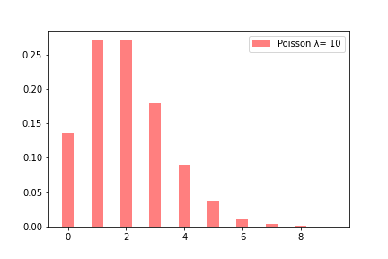
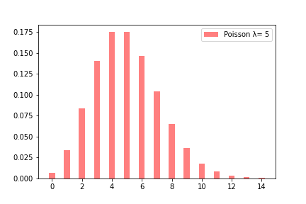
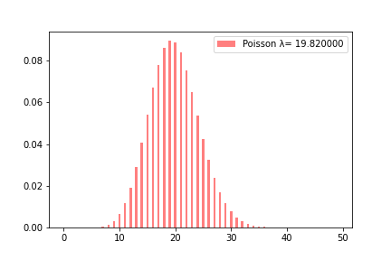
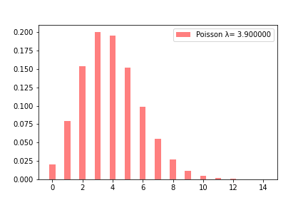
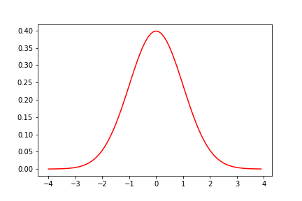

# 第４週：データの性質と確率分布{#distribution}


```{r setup_chap4, echo=FALSE}
knitr::opts_chunk$set(cache=TRUE)
```

今回の講義では数式がいくつか現れるが、覚える必要はない。


## 標本と無作為抽出{#random_sampling}

話を、ある会社の管理職（かんりしょく：manager）が一ヶ月に出席する会議の数に戻そう。


「管理職」が定義できているとして（つまり、その会社で管理職とは誰を指すのかがはっきりしていれば）、次に必要なのは管理職にあたる人たちが、1ヶ月に出席した会議の数である（ここで「会議」が何を指すのかは明確になっているとする）。
ただし、「一般職と比べて管理職は出席すべき会議の数が多い」と主張しているのであれば、一般職（いっぱんしょく：employee）が出席した会議の数も集めなければならない。

厳密（げんみつ、正確）に考えると、いま現在、会社に在職している社員だけでなく、過去に在職したすべての管理職と一般職の全員について、彼女ら・彼らが入社して以来、毎月、出席した会議の数がデータとして必要だろう。しかしながら、実際にデータとして手に入るのは、いま会社にいる管理職と一般職の、それも全員ではなく、一部の人たちだけということもあるだろう。さらには、記録があるのが、先月の会議出席回数だけという場合もあるだろう。


このように必要とする全データは存在せず、ごく一部のデータだけが得られているというケースは多い。
ここで本来対象となるべき全データ（管理職と一般職がこれまで出席した会議の全回数）を**母集団**(ぼしゅうだん：population)、その一部分のことを**標本**(ひょうほん：sample)として区別（くべつ）する。


一般に母集団のデータを得ることは難しい。たとえば、日本に在住（ざいじゅう、暮らす）する20歳の男性の身長データが必要だとして、現実には20歳の男性全員の身長をはかることなどできないだろう。
また、そもそも、該当する20歳男性の数は日々異なっている。新しく20歳の誕生日（たんじょうび）をむかえる人もいれば、若くしても亡くなってしまう人もいる。つまり、20歳男性の数は毎日（毎時間）異なっている。

<iframe width="560" height="315" src="https://www.youtube.com/embed/eIZD1BFfw8E" frameborder="0" allow="accelerometer; autoplay; encrypted-media; gyroscope; picture-in-picture" allowfullscreen></iframe>


「管理職の一ヶ月の会議数は20回を超える」と主張（しゅちょう：argue）する場合、母集団として想定されるのは、実は過去から現在に至るまで在職した（今だけでなく、昔、会社につとめていた）すべての管理職だけではない。将来の（未来の）管理職についても想定されていると考えることもできる。実際、この講義の最初に紹介した「ビジネスの世界も同様だ。管理職になると、月に二十回から三十回以上の会議に参加しなければならないというデータもある」という言葉は、これから管理職になる人へのアドバイスのように思える。

また「一ヶ月の会議数」という場合、ある月の出席回数ということではなく、「毎月の平均的な会議数」と主張されていると考えるべきである。
毎月開催される会議の数は、季節によって違ってくるであろう。その意味では、ある程度長い期間、毎月の会議数がデータとしてそろっていることが望ましいが、それは現実的ではないだろ。


このように、現実に入手できる、あるいは手もとにあるデータは、標本にすぎない場合がほとんどである。
ただし、標本であっても、いくつかの条件を満たしているのであれば、母集団の情報（今の例では「管理職が毎月出席する会議の回数」）についての確かな判断を行うことができる。


それは、標本データが無作為抽出されている場合である。
無作為抽出(むさいくちゅうしゅつ：random sampling)とは、どの対象も同じ確率で選ぶことである。
たとえば、裏表のどちらかに偏り(かたより：bias)のないコインを投げて(coin toss) 表 (head) がでた（表が上をむいた）回数の記録を取ることは無作為抽出にあたる。
コインを１回投げる場合、表が上を向く確率と、裏(tail)が上を向く確率は等しい（1/2）だろう。
ただし、よく誤解されていることだが、表と裏それぞれが1/2の確率ででるからといって、たとえば、 6 回コインを投げたとしても、
「裏、表、裏、表、裏、表」のように、表と裏が交互にちょうど3回ずつ出ることは稀で（まれで、めずらしい）、むしろ非常に不自然（ふしぜん、おかしい、変）である。実際に自分でコインを6回繰り返し投げてみると、「裏、裏、表、裏、裏、裏」と、裏が5回も出てしまうこともあるだろう。

コインを投げる試行(しこう：trial)の回数が少ないと、裏と表、どちらかに偏った（かたよった：bias、どちらかが多い）結果となるだろうが、コインを投げることを1000回、１万回と繰り返してみると、それぞれが出る確率は1/2に落ち着くということである（これについては第6回の講義でもう一度説明する）。

<iframe width="560" height="315" src="https://www.youtube.com/embed/cXNDqOJD5b4" frameborder="0" allow="accelerometer; autoplay; encrypted-media; gyroscope; picture-in-picture" allowfullscreen></iframe>


実際に無作為抽出する場合、十分に多くの繰り返しをしなければ、偏りが生じるものである。それでも、人為的（じんいてき、不自然）な偏り（たとえば、会社全体の管理職の出席会議数を調べたいのに、会社の人事部の社員だけを調べたとか、あるいは男性だけを調べたとか）に比べれば、母集団の性質を偏りなく推論(すいろん：infer)できる。

無作為抽出されたデータ数が多ければ、母集団をより正確に反映していると考えることができる。ちなみに標本を構成する要素（ようそ：element）の総数を**標本サイズ(sample size)**と表現する。
他に、「標本数（ひょうほんすう）」という言い方もあるが、これは標本を構成している要素の総数を指すのか、あるいは標本の集合（セット）が何本（いくつ）あるのか、
解釈がやや曖昧になるので避けた方がいいだろう。


さて、母集団が同質の集団とは限らない。たとえば、人間が対象である場合、年齢や性別はさまざまである。これらを**属性**（ぞくせい：attributes）という。
こうした属性ごとの特徴を調べたいのに、単純に無作為抽出すると、標本に偏り（かたより）が生じる可能性が高い。
たとえば、日本人全体を調べたいのに、調査した標本の70％が男性であったとか、80％が65 
歳以上の高齢者だったということが起こり得る。

テレビや新聞では、世論調査（よろんちょうさ：census）の結果をよく報道（ほうどう）している（ちなみに、テレビや新聞の世論調査は信用できないと考えたほうがよい）。これはRDDという方法で調査を行っている。RDDは「ランダム・デジット・ダイヤリング（Random Digit Dialing）」の略で、コンピューターで無作為に数字を組み合わせた電話番号を作り、たまたま受話器をとった人に質問を行っている（実際には録音（ろくおん）を流すだけであるが）。ランダムなので、偏りがでないように思われるかもしれないが、もし生成する電話番号が固定電話（こていでんわ、家庭にある電話）の場合、受話器を取るのはその時間に家にいる人に限られる。この結果、回答者が、仕事をしていない高齢者、あるいは専業主婦・主夫（せんぎょうしゅふ）に偏る傾向があった。現在は携帯電話（けいたいでんわ）も対象とするようだが、これもまた、問題がある。携帯電話番号には、固定電話と違い、市外局番（しがいきょくばん：area code）のような地域情報がない。このため、ランダムに生成した携帯電話番号による調査の回答者が、東京や大阪など、住民の多い地域に偏る恐れ（おそれ、心配）がある。


属性ごとの特徴を調査したいのであれば、標本を集めるのに層別（そうべつ：stratified sampling）をおこなう。社員が出席する会議数の例でいうならば、調査対象となる人が総務部や人事部に偏らないよう、すべての部署（ぶしょ：department）から、まんべんなく社員が選ばれるようにする。
さらには、男女を同じ数にするとか、あるいは年齢が均一（きんいつ、同じ）になるように配慮（はいりょ、こうりょ）する。
ただし、層(stratum)をあまり細かくすると、そもそも、その層を代表する人の数が少ないこともありうる（たとえば、日本の会社では管理職で若い女性という層は少ないだろう）。

母集団から標本の選ぶ方法は、「社会調査法（しゃかいちょうさほう）」という分野で詳しく検討がなされている。データ分析おいて、ある課題を検討するために抽出された標本データが、
母集団を正しく反映しているのかは重要な問題である。

[外部サイト：ウィキペディア：社会調査法](https://ja.wikipedia.org/wiki/%E7%A4%BE%E4%BC%9A%E8%AA%BF%E6%9F%BB){target=_blank}


 
## 要約統計量{#summary_stastistics}


データはしばしば平均値によって代表・要約（ようやく：summarize）されることが多い。
そのため、平均値のことをデータの**要約統計量**（ようやくとうけいりょう：summary statistics）ということがある。

要約統計量には、他に**中央値**(median)や**分散**(ぶんさん：variance)、**標準偏差**(ひょうじゅんへんさ：standard deviation)、**四分位範囲**(しぶんいはんい：interquartile range)などがある。まずは平均値(mean)について検討する。


## 平均値{#mean}


一般に平均値は、標本のすべての観測値（かんそくち：observed values）を加算（かさん）して、標本サイズで割った数値を指す。算術平均（さんじゅつへいきん）とも、単に平均ともいわれる。


$$
\bar{X} = {\frac {1}{N}}\sum _{i=1}^{N}x_{i} = {\frac {x_{1} + x_{2}+\cdots + x_{n}}{N}}
$$

統計学では $X$ は**確率変数**（かくりつへんすう：random variable, aleatory variable, stochastic variable）を表す。
$x_i$ は、確率変数 $X$ のある実現値である。
$\bar{X}$ はエックスバーとよむ。$X$ の平均値のことで、統計学で標本平均値を表す記号としてよく利用される。なお、算術平均値の他に、幾何平均（きかへいきん：geometric mean）、加重平均（かじゅうへいきん：weighted mean）が使われることもある。


[外部サイト：ウィキペディア：幾何平均](https://ja.wikipedia.org/wiki/%E5%B9%BE%E4%BD%95%E5%B9%B3%E5%9D%87){target=_blank}


確率変数は、ある決まった確率である値を取る変数のことである。たとえば、コインであれば1/2の確率で表が、同じく1/2の確率で裏が出る。
以下のように $X$ がある特定の結果になる確率を $P(X)$ で表すことも多い。

$$
P(X) = \frac{1}{2} \, \, \, (X = \text{表} \,\,, \, \text{裏}) 
$$


たとえば、ある会社の管理職から11名を選んで、先月出席した会議数について報告してもらったところ、以下のような数値が得られたとする。


| 1  | 2  | 3  | 4  | 5  | 6  | 7  | 8  | 9  | 10 | 11 |
|----|:---|:---|:---|:---|:---|:---|:---|:---|:---|:---|
| 23 | 16 | 23 | 20 | 18 | 19 | 19 | 15 | 20 | 22 | 23 |
Table: 管理職１１人の先月の会議出席数 
  
この平均値は約 19.82 となる。会議の出席数は整数（**離散値**りさんち：discrete valueともいう）であるが、平均値はデータを合計してデータ数で割り算をするというシンプルな計算方法なので、割り算の結果、端数（はすう、この例では小数点以下の 0.82 が端数である）が出てしまう。


Pythonで平均値を求めるにはリストか *numpy* の配列、あるいは **pandas** のシリーズを作成して、`mean()` を適用する。

```
# Python
import pandas as pd
x = pd.Series([23, 16, 23, 20, 18, 19, 19, 15, 20, 22, 23])
x.mean()
```

一方、中心を表す統計量には他に中央値がある。これは、データを小さい順に並べた時に中心に位置する値を代表値あるいや要約量とみなす方法である。

以下は日本語ウィキペディアの「中央値」にある画像である。


[外部サイト：ウィキペディア：中央値](https://ja.wikipedia.org/wiki/%E4%B8%AD%E5%A4%AE%E5%80%A4){target=_blank}


この図の中央にあるmedianが中央値のことであるが、中央値の左右には同じ個数のデータがある（左右それぞれにデータが50％ずつある）。
これに対して、図の下のmean平均値は、データの重心である。左右が釣り合う位置に対応する。


管理職１１名の会議出席数を小さい順に並べてみよう。


| 1  | 2  | 3  | 4  | 5  | 6  | 7  | 8  | 9  | 10 | 11 |
|----|:---|:---|:---|:---|:---|:---|:---|:---|:---|:---|
| 15 | 16 | 18 | 19 | 19 | 20 | 20 | 22 | 23 | 23 | 23 |
Table: 管理職１１人の先月の会議出席数 （昇順並べ替え）

この場合、真ん中にある数値は 20 である。つまり、20 が中央値となる。これはデータ数がたまたま奇数個あるからであって、
偶数個の場合は中央の二つの値の平均値を取るなどの調整（ちょうせい）を行う。
1,2,3,4,5 という5個のデータがあった場合、この中央値は3であるが、
1,2,3,4,5,6 という6個のデータの中央値は3.5（(3+4)÷2）である（ただし、データに同数の値 ties がある場合、もう少し複雑な計算が行われることもある）。


``` 
# Python
x.median(x)
``` 

平均値と対して、中央値の方がデータを代表する値として望ましいと例として、年収（ねんしゅう：salary）があげられる。たとえば、管理職の年収が以下のようだったとしよう（単位は万円）。


| 1      | 2     | 3    | 4    | 5    | 6    | 7    | 8    | 9    | 10   | 11   |
|:-------|:------|:-----|:-----|:-----|:-----|:-----|:-----|:-----|:-----|:-----|
| 125000 | 10000 | 2200 | 1800 | 1600 | 1400 | 1400 | 1400 | 1400 | 1300 | 1300 |

Table: 管理職１１人の年収


この平均値は約 13527.27 万円となるが、データでは管理職のほとんどは 1000 万円台の年収でしかない。

これは、1番目の管理職（おそらくは CEO）だけ、年収が非常に高いのに引きずられた結果である。
年収や貯蓄額（ちょちくがく：savings）については、中央値のほか、次に説明する最頻値も代表値として望ましい。


## 中央値と最頻値{#median}

このようにデータに一部だけ極端に高い値があるような場合は、平均値よりも中央値のほうが、直感的にはデータを代表するのにふさわしいという場合がある。
この例で、中央値は6番目の管理職の年収である 1400 万円ということになる。

また**最頻値**（さいひんち：mode）という要約統計量がある。これは観測数のもっとも多い数値で代表させる方法である。


先のデータでは 1400 万円の管理職が 4 人いるため、最頻値は 1400 万ということになる。
ただし、ここで中央値と最頻値が一致しているのは偶然にすぎない。最頻値はある区間をとって、その区間に属するデータの数で判断することもある。
たとえば、管理職の年収を1000万未満(みまん less than)、1000万以上（いじょう：not less than）1400万未満、1400万以上1800万未満、1800万以上の5つの区間（くかん）に分けるとする。
そして、それぞれの区間に属するデータ数（管理職の人数）をカウントすると次のようになる。


| 1800万以上 | 1400万以上1800万未満 | 1000万以上1400万未満 | 1000万未満 |
|-----------|:--------------------|:--------------------|:---------|
|          4 |                    5 |                    2 |          0 |

Table: 管理職１１人の年収

この場合、1400万以上1800万未満の区間が 5 名ともっとも多いので、最頻値は「1400万以上1800万未満」ということになる。
なお、区間のことを階級（かいきゅう、class）あるいはビン(bin)とも表現する。なお、区間（階級、ビン）の設定は分析者に委ねられるため、最頻値は恣意的になりやすいことに注意が必要である。


ちなみに平均値は英語で mean, 中央値は median, そして最頻値は mode というため、これらを 3M と表現することがある。
なお average という英語は、これらを総合した表現と考えるべきだが、一般には mean と同義として使われている。


## 期待値{#expectation}

前節で求めた 11 名の管理職の会議数の平均値は 19.82 だった。ただし、対象となった 11 名の他にも、まだ管理職はいるのかもしれない。
また、過去ないし未来の管理職も対象とすべきかも知れない。
つまり、今回求められた平均値の 19.82 は、標本の平均値にすぎない。
ちなみに、これを**標本平均値**（ひょうほんへいきんち：sample mean）ということもある。
ここで本当に知りたいのは、母集団（過去および未来の管理職の仮想的な集団）の会議出席数の平均値である。これを**母平均値**（ぼへいきんち：population mean）ということもある。
しかしながら、実際には母集団全体を調べることができないため、母平均値はわからないのが普通である。

ただし、母平均値を推定することはできる。それは、データが得られる仕組み（しくみ：system）が分かっている場合である。

たとえば、1 から 6 の数字が刻印されたサイコロという遊具(ゆうぐ、おもちゃ：toy)がある。


<iframe width="560" height="315" src="https://www.youtube.com/embed/-emW_1VrGn0" frameborder="0" allow="accelerometer; autoplay; encrypted-media; gyroscope; picture-in-picture" allowfullscreen></iframe>

サイコロはゲームやギャンブルで、数値を出すための道具で、振り投げて着地した時、上を向く面の数値が 1 から 6 まで同じ程度になるように工夫されている。


つまり、6つの面のそれぞれが出現する確率は 1/6 と等しい。
もちろん、ピッタリ 1/6 の確率ということはなく微妙な誤差（ごさ）はあるだろうし、疑い出せば、製造過程で偏りが加えられる可能性もあるだろうが、
ここでは、そのような誤差は無視できる程度とし、また不正はないと信じられるものとする。

この遊具を 10 回振って、上を向いた面の数値について、その平均的な値を求めたいとする。
ここで、実際にサイコロを 10 回振ることを Python で試してみよう。

```
# Python
import numpy as np
np.random.seed(123)
s = np.random.randint(1,7, 10)
s
```

```
array([6, 3, 5, 3, 2, 4, 3, 4, 2, 2])

```


データサイエンスは、ある確率でデータが出現する仕組みをシミュレーションで確かめることがよくある。
そのため、Python や R といった統計処理用のプログラミング言語（および、そのライブラリ）には、確率的なシミュレーションをするツールが備わっている。
あるいは、乱数(らんすう：random numbers)を生成するツールがある。

上の例では、 `np.random.randint()` は 1  から 6 まで（紛らわしいが、7の一つ前という指定である）の間の整数を、無作為に1つ取り出すことを、10回繰り返すことを指定している。ここで、1,2,3,4,5,6 のどれかが出る確率は、いずれも 1/6 と同じである。
本来、無作為なシミュレーションなので、毎回、実行するたびに結果は異なる。ただし、再現性（さいげんせい：reproducibility）を保証するため、乱数の種（たね：seed）を設定してから実行すると、同じ結果をえることができる。それが `np.random.seed(123)` である。ここで 123 という数値に意味はない。

平均値を求めてみよう。

```
# Python
s.mean()
```

```
3.4
```


平均値は 3.4 と出たが、改めて、もう一度 10 回サイコロを振ってみると異なる結果になるだろう。


```
# Python
s = np.random.randint(1,7, 10)
s.mean()
```

```
2.8 # 乱数を生成して、その平均値を求めているので、結果は毎回異なる
```

サイコロの各面の数値が出る確率は同じ 1/6 だが、仮に 6 回振ったとしても 1 から 6 の間の数字が出揃うということはない。
上の実行例では 10 回中 3 は一度も出現していないのに、1 は 4 回も出現している。10 回程度の試行（サイコロを振ること）では、出現に多少偏りが出る方が自然である。
しばしば誤解されていることであるが、サイコロの各面の出現確率が 1/6 という意味は、6 回サイコロを振れば、各面（数値）が必ず一度は出現するということではない。
サイコロは前回までにどのような面が出たかは記憶（きおく）しているわけではないので、何回試行しようとも、各面が出現する確率はやはり 1/6 のままである。

ただ、サイコロの例では各面（数値）のそれぞれが 1/6 の確率で出現するという情報がある。
この情報が確かであれば、ここから 10 回振った出る数値の理論的な平均値を求めることはできる。
それは以下のように計算するのである。

まず、サイコロを 1 回振った場合の **期待値** （きたいち：expectation）を求める。これは、各面の数値と、その面が出る確率の積（せき：product）を、すべて合計した値である。
以下の式で $E[X]$ は $X$ の期待値を表す記号である。また $X$ は、1 から 6 までのいずれかの整数という意味で、変数、あるいは **確率変数** （かくりつへんすう：random variable, aleatory variable, stochastic variable）という。

$$
\begin{aligned}
E[X] & = 1 \times \frac{1}{6} + 2 \times \frac{1}{6} + 3 \times \frac{1}{6} + 4 \times \frac{1}{6} + 5  \times \frac{1}{6} + 6  \times \frac{1}{6} \\
     & = 3.5
\end{aligned} 
$$

すなわち、期待値とは、各面が出現する確率に数値を乗じた和のことである。
以下で $N$ は標本サイズを、 $x_i$ は確率変数 $X$ の $i$ 番目の実現値を表すが、特に覚える必要はない。

$$
\mu = \frac{1}{N} \sum_i^N x_i P(x_i)
$$

$\mu$ ミューは、英語の平均値 mean の頭文字 m に相当するギリシャ文字である。統計学で期待値を表す記号をしてよく使われる。

サイコロを10 回振る場合だと、各試行での期待値、そのまた期待値を求めることになる。つまり、$E[X]=3.5$ を 10 倍して 10 で割るのだから、結局 3.5 である。
このように、サイコロを振って出る面（の数値）の期待値は一意（いちい）に定まる(uniquely determined)。一方、標本から求める標本平均値は、標本ごとに常に変動（へんどう）する。

ただし、これはサイコロで各面の出る確率に確信（かくしん：confidence）があればこその話である。
ちなみに、サイコロの 1 から 6 までの各面がそれぞれ決まった（この場合 1/6 で）確率で出ることを **分布** （ぶんぷ：distribution）という。


再び話を戻して、管理職が毎月出席すべき会議数の期待値はどのように求められるであろうか。
実は、この段階では期待値は求めようがない。単に、標本平均値を計算できるだけである。
それは、サイコロの場合と違って、会議数を決定する仕組みが分からないからである。つまり、毎月の会議数が 10 回となる確率、
あるいは 20 回となる確率について情報がなければ、期待値を求めることはできない。
つまり、会議数の分布を知る必要がある。

実は、データサイエンスで扱うデータは、その分布について正確な情報がないことが多い。
この場合、期待値も求められない。そこで、データに分布を**仮定**（かてい：hypothesize）する。


## ポアソン分布{#pois}

会議数の分布について、いま手もとにある 11 人の管理職の出席回数以外には、我々には何の情報もないとする。つまり分布はわからない。
ただし、会議の出席回数のように、それほど多くはないであろう（と望みたいところであるが）回数データについては、ポアソン分布になぞらえることができるかもしれない。
**ポアソン分布**(poisson distribution)は、ある一定の期間（あるいは、ある一定の区域）にまれに発生する現象をうまく表現できるとされる確率分布である。
たとえば、ある交差点で 1 年間に発生する交通事故の回数とか、宝くじ売り場(lottery tickets place)に 1 時間辺りに訪れるお客の数、森のある区域（くいき：area）で観測される野生動物（やせいどうぶつ）の頭数（とうすう）、1 時間あたりに受信するメールの数などがポアソン分布で表現できるだろう。


<iframe width="560" height="315" src="https://www.youtube.com/embed/jmqZG6roVqU" frameborder="0" allow="accelerometer; autoplay; encrypted-media; gyroscope; picture-in-picture" allowfullscreen></iframe>


具体的にみてみよう。1 時間辺りに受け取るメールの数がポアソン分布に従い（したがい：follow）、かつその平均値（平均的な受信メール数）が 2 通だとしよう。
ポアソン分布を仮定することにより、1 時間辺りに受信するメールの数が 0 個である確率、1 個の確率、2 個の確率が求められるのである。

ちなみに、以下のPythonのコードでは、新たに **scipy** ライブラリを利用している。Anacondaをインストールした場合、**scipy** はすでにインストールされているが、
そうでない場合は、ターミナル（コマンドプロンプト）で  `pip install scipy` を実行してインストールしておこう。


```
# Python
from scipy.stats import poisson
import matplotlib.pyplot as plt
import numpy as np
x =  np.arange(0, 10, 1)
y = [poisson.pmf(i, 2) for i in x]
plt.bar(x, y, align="center", width=0.4, color="red",
                alpha=0.5, label="Poisson λ= %d" % 10)
plt.legend()
## plt.show()# Jupyter以外の環境ではこの命令が必要
```


上の図は次のように見る。横軸（よこじく）が受信したメールの数で、たとえば横軸（X軸）目盛りの 2 は、1 時間あたりに受信するメールの数が２通であることを意味する。
そして縦軸（たてじく、Y軸）は確率を表している。この例では 2 の位置にある棒の高さは 0.27のあたりである。
つまり、1時間で受信するメールの数が 2 個となる確率は 0.27 である。
またX軸の左端の 0 は受信数が 0 となる確率で、約 0.14 である。
さらに、X軸の右端の 8 は受信数が 8 となる確率で 0 にちかい（約0.0009）。
つまり、各棒（バー）の高さが確率に対応しており、これらの確率をすべて足すと 1 となる（厳密にいうと、実は１時間に受信するメールの数が 8 を超える確率は完全に 0 ではないのだが、ここでは無視する）。

コードで `poisson.pmf(x,mu)` は、平均値 `mu` であるポアソン分布で、１時間あたりに受け取るメールの数が `x` となる確率を出力する。
`Y` は確率である。

pmf は**確率質量関数**（かくりつしつりょうかんすう： probability mass function） の略である。
先に示した関数 $P()$ に相当する。

$$
\mu = \frac{1}{N} \sum_i^N x_i P(x_i)
$$

また、上のコードでは、０から１０の範囲の整数それぞれについて、確率を求めるのにカギカッコ(`[]`）を使っているが、これはPythonの内包表記という方法を使っている。
すなわち、$X$ がポアソン分布にしたがうとして、その平均値が ２ の場合に、メールの受信数が ０ から ９ となる確率をまとめて求めている。

[外部サイト：Qiita：Python 内包表記](https://qiita.com/y__sama/items/a2c458de97c4aa5a98e7){target=_blank}

前節で取り上げたサイコロでは、各面が上を向く確率はすべて 1/6 で同じであったが、メールの受信数の場合は確率がバラバラである。
ただし、サイコロでもメール数でも確率の合計値は 1 である。これを**確率分布**（かくりつぶんぷ：probability distribution）という。

ある確率分布は、その**パラメータ**で形状が一意に定まる。ポアソン分布の場合、パラメータとは期待値のことである（ポアソン分布のパラメータは、慣例（かんれい、普通）として、$\lambda$ ラムダで表されることが多い）。たとえば、期待値が 5 のポアソン分布は以下のようなグラフになる。


```
# Python
x =  np.arange(0, 15, 1)
y = [poisson.pmf(i, 5) for i in x]
fig = plt.figure()
ax = fig.subplots()
ax.bar(x, y, align="center", width=0.4, color="red",
                alpha=0.5, label="Poisson λ= %d" % 5)
plt.legend()
## plt.show()
```



逆にいえば、会議の回数や、道路で目撃した猫の数などの分布にポアソン分布をあてはめるのであれば、その期待値を仮定（かてい）しなければならない。


ちなみにポアソン分布は以下の式で表され、式中の $\lambda$ が期待値にあたる。
この式で $k$ に事象（じしょう、できごと、おこること：event）の回数を指定すると、その事象の生じる確率が求まるようになっている。なお、ポアソン分布は離散値（正の整数）の分布を表すが、その期待値は正の実数である。
つまり、小数点で表される数である。

$$
P(X=k)=\frac{\lambda^k \mathrm{e}^{-\lambda}}{k!}
$$

ここで $e$ はネイピア数、あるいはオイラー数と呼ばれる定数（ていすう：constant）で約 2.72 である。また $k!$ は階乗（かいじょう：factorial）を表し、 
$3!$ であれば $3 \times 2 \times 1$ のことである。
具体的に計算してみよう。たとえば、パラメータが 19.82 の場合、一ヶ月の会議出席数が 20 回ちょうどになる確率は以下のように計算される。


$$
P(X=20)=\frac{19.82^{20} \mathrm{e}^{-19.82}}{20!}
$$

```{r echo=FALSE}
(19.82^20 * exp(-19.82)) / factorial(20) 
```


```
# Python
import math
(pow(19.82,20) * math.exp(-19.82)) / math.factorial(20)
```

```{r echo=FALSE}
(19.82^20 * exp(-19.82)) / factorial(20) 
```


もっともPython には、ポアソン分布の確率を求める関数が備わっている。


```
# Python
from scipy.stats import poisson
poisson.pmf(20,19.82)
```


管理職の毎月の出席会議数に話を戻すと、その分布は不明であるが、ある単位内（ここでは一月）に生じる現象の回数なので、ポアソン分布に近いのではないかと仮定してみよう。

さらにいえば、ポアソン分布のパラメータ（期待値、母平均）も不明なのだが、今回集められた会議出席数から単純に求めた標本平均値は 19.82 で中央値は 20 であった。そこでパラメータとして 19.82を当てはめて、分布を確認しよう。
 
 
```
# Python
x =  np.arange(0, 50, 1)
y = [poisson.pmf(i, 19.82) for i in x]
fig = plt.figure()
ax = fig.subplots()
ax.bar(x, y, align="center", width=0.4, color="red",
                alpha=0.5, label="Poisson λ= %f" % 19.82)
plt.legend()
## plt.show()
```



このグラフからは、会議数の平均である 20 回の位置の棒（ぼう、バー）がもっとも高く、その確率は 0.09 である。また 20 回以上（21回、22回、23回などなど）となる確率もかなりあることが分かる。会議数が 20 回以上になる確率は約 0.51 であり、20 回未満である確率も約 0.49 ある。


一ヶ月の会議数が 20 回未満（つまり 19 回以下）となる確率を求めてみよう。


```
# Python 
poisson.cdf(19, 19.82)
```

`poisson.cdf()`
は累積確率（るいせきかくりつ：cumulative probability）を求める関数で、一般には分布関数（ぶんぷかんすう：distribution function）とよばれる。
cdfは Cumulative Distribution Function の略である。

$$
F(x) = p(X \leq x) = \sum_{X \leq x} P(X)
$$

すなわち、指定された回数だけでなく、それより小さな回数の確率をすべて合計した値が得られる（日本語で累「積」と訳すが、すべての値を乗じるわけではない）。

また、このグラフから、もしも管理職の会議数がポアソン分布にしたがうとすれば、一ヶ月の会議数が 10 回以下になることは少ない。
その一方で、会議数が 20 回を超えることは珍しくない。
ちなみに、会議数が10回以下になる確率は1％程度である。つまり、管理職になると毎月出席すべき会議の数が10回以下になる可能性はほぼない。


```
# Python 
poisson.cdf(10, 19.82)
```


これに対して、20回以上になる回数は約51％である。を使って求めるならば、以下のようにすれば良い。


```
# Python 
1 - poisson.cdf(19, 19.82)
```

確率は全体で1.0であるから、会議数が19回以下となる累積確率を 1.0 から引き算すれば、会議数が 20 回以上となる確率が求められる。


管理職の出席会議数の分布を仮定したので、次に、一般職が一月に出席する会議数についても、ポアソン分布を当てはめて考えてみよう。
一般職11人の先月の出席会議数は以下のようになっていた。


| 1 | 2 | 3 | 4 | 5 | 6 | 7 | 8 | 9 | 10 | 11 |
|---|:--|:--|:--|:--|:--|:--|:--|:--|:---|:---|
| 2 | 3 | 3 | 3 | 4 | 4 | 4 | 4 | 5 | 5  | 6  |
Table: 一般１１人の先月の会議出席数 （昇順並べ替え）

標本平均値は約 3.9 なので、これをポアソン分布のパラメータとして、分布をグラフにしてみよう。


```
# Python
x =  np.arange(0, 15, 1)
y = [poisson.pmf(i, 3.9) for i in x]
fig = plt.figure()
ax = fig.subplots()
ax.bar(x, y, align="center", width=0.4, color="red",
                alpha=0.5, label="Poisson λ= %f" % 3.9)
plt.legend()
## plt.show()
```




一般職の場合、一ヶ月の出席会議数が 20 回以上になることは、まず無いようである。


```
# Python
1 - poisson.cdf(19, 3.9)
```

```
 6.7555191440860085e-09
```

ちなみに、出力にある `e-09` という表記は、直前の数値に $10^{-9}$ を乗じることを表している（指数表記、しすうひょうき）。この場合、ほぼゼロとみなして差し支えない。

[外部サイト：ウィキペディア：指数表記](https://ja.wikipedia.org/wiki/%E6%8C%87%E6%95%B0%E8%A1%A8%E8%A8%98){target=_blank}

まとめると、一般職で毎月の会議数が 20 を超えることはほぼ無いが、管理職の場合、毎月の会議数が 20 回以上となることはままある（51％）ことがわかった。

ここで、この授業の最初に紹介した文章をもう一度引用しよう。

「ビジネスの世界も同様だ。管理職になると、月に二十回から三十回以上の会議に参加しなければならないというデータもある。」


会議への出席回数データにポアソン分布をあてはめられるとすれば、ある月の管理職の出席会議数が20回を超える確率は 50％を超えるが、20回未満である確率も 50％近くあることから、この発言は、管理職の忙しさを、やや強調（きょうちょう、おおげさにいう）しすぎと判断できる。

ただし、同じ会社の一般職のデータにやはりポアソン分布を仮定すると、ある月の会議数が 20 回を超える確率はほぼゼロであるため、「管理職は（一般職より）出席すべき会議数が多い」ということを強調したかった発言（はつげん、主張）だと理解すれば、おおむね妥当だ（だとうだ、正しい）と判断して差し支えない（かまわない）といえるだろう。

まとめると、ある判断が根拠に基づいているかどうかを、データサイエンスではデータに基づいて確認するわけだが、その1つの方法が、データに確率分布を仮定することである。


[外部サイト：ウィキペディア：ポアソン分布](https://ja.wikipedia.org/wiki/%E3%83%9D%E3%82%A2%E3%82%BD%E3%83%B3%E5%88%86%E5%B8%83){target=_blank}


## 正規分布{#normal}

先に、管理職の出席会議数の分布にポアソン分布を仮定し、そのパラメータを 19.82 と想定した。


```{r distribution_poisson, echo=FALSE, message=FALSE}
library(tidyverse)
set.seed(123)
x <- dpois(0:50, 19.82)
plt <- x %>% tibble(mail = 0:50, Prob = x) %>% ggplot(aes(x =mail, y = Prob),) + geom_bar( stat="identity" ) + xlab("会議数") + ylab("確率") +
  ggtitle("管理職の１ヶ月あたりの出席会議数")
plt
```
 

この図は、平均値に近い 20 を中心に、左右のバーが対称に並んでいるように見える。
実はポアソン分布はパラメータが大きくなると、別の分布にきわめて似てくる。これを近似（きんじ：approximation）と表現する。
この場合であれば、別の分布とは正規分布（せいきぶんぷ：normal distribution）のことである。

平均値がちょうど 0 の正規分布の形を描いてみよう。ただし、正規分布にはパラメータが 2 つある。
平均値（期待値）と標準偏差である。標準偏差（ひょうじゅんへんさ：standard deviation）とは、データの散らばりのことだが、詳細（しょうさい：detail）は後で説明するとして、以下のグラフでは標準偏差は1としている。とりあえず以下のグラフにおける横幅（X軸）の単位と考えておく。


```{r dist_normal_20, echo=FALSE}
# R
X <-  seq(-4, 4, .1)
Y <- dnorm (X, mean = 0, sd = 1)

dat <- data.frame(X = X, Y = Y); 
p <- ggplot(data=dat, aes(x = X,y = Y), size = 2) + geom_line() +
  scale_x_continuous(name ="パラメータ：平均値が0で標準偏差が1",
                       breaks=c(-2,0,2)) +
  ggtitle("正規分布のグラフ")
```


 ```
 # Python
import numpy as np
from scipy.stats import norm
# −4 から 4 まで0.01間隔で入ったリストを作成
X = np.arange(-4,4,0.1)
# 正規分布の確率密度関数に平均0、標準偏差1を指定
Y = norm.pdf(X,0,1)
fig = plt.figure()
ax = fig.subplots()
ax.plot(X,Y,color='r')
## plt.show()
 ```



`norm.pdf()`
は確率密度関数（かくりつみつどかんすう：probability density function:PDF）を求める関数である。これについては後述するが、
確率密度関数が出力する `Y` は確率ではなく密度（みつど：density）である。つまり、このグラフの縦軸は確率ではない。
連続量の分布では、確率はX軸の範囲の面積（めんせき:area）で考える。

$$
\int_{-\infty}^{\infty} f(x) d x = 1
$$

確率密度関数は値を累積すると、つまりは積分（せきぶん：integrate）すると 1.0 になる。上のグラフでは、曲線とX軸に挟まれた全面積（めんせき：area）が 1.0 となる。


正規分布は、平均値を中心に左右に対称（たいしょう：symmetry）となる分布を表現している。
横軸は、あるデータの散らばり（deviance）を表している。
平たくいえば、正規分布は、平均付近に多くのデータが集まり、平均から外れた（平均値より大きいか、あるいは小さい）
データは少ないことを表している。これは、直感的にも納得できるのではないかと思うが、世の中の多くのデータに当てはめることができそうな分布とも言える。

たとえば、身長が平均値より極端に高い人や、極端に低い人は少ないだろう。「極端（きょくたん：extreme）」という言葉が曖昧（あいまい）に思えるかもしれないが、
正規分布では「極端」を数値に対応して考えることができる。それは、平均値から標準偏差 2 個分の幅を考えるのである。

以下は、偏差値（へんさち）の分布を表すグラフである。偏差値は、大学入試試験などの模試（もし：pre test）の成績(scores)を正規分布を当てはめた数値であり、
平均値が 50 で標準偏差が 10 と調整されている。


```{r echo =FALSE}
library(ggplot2)
X <-  seq(0,100, 1)
Y <- dnorm (X, mean = 50, sd = 10)
dat <- data.frame(X = X, Y = Y); # dat
p <- ggplot(data=dat, aes(x = X,y = Y), size = 2) + scale_x_continuous(name ="偏差値",  breaks=c(30,50,70))
p <- p + stat_function(fun= ~dnorm(X, mean = 50, sd = 10),size=1)
p + geom_ribbon(data=subset(dat, X >= 30 & X <= 70), aes(ymin = 0, ymax = Y), fill="skyblue",colour=NA,alpha=0.5) +  labs(title = "平均値50で標準偏差10の正規分布の95%範囲")+theme(axis.text=element_text(size=12),axis.title=element_text(size=14,face="bold")) + geom_segment(x = 30, xend = 30, y = 0, yend = .005,size = 1.0) + geom_segment(x = 70, xend = 70, y = 0, yend = .005, size = 1.0) + geom_text (label = "<30...",x = 30, y = -0.01, size = 8) + geom_text (label = "...>70",x = 70, y = -0.01, size = 8) 
```


偏差値では、30以下と70以上が極端な値と判断される。つまり平均である 50 に、標準偏差である 10 を2倍した値を加除した範囲である。なぜ、標準偏差２個分かというと、正規分布においては、平均値から標準偏差2個分引いた値以下となるデータ、あるいは平均値より標準偏差2個分足したデータは、それぞれ 2.5％ ずつしかないからである。

<iframe width="560" height="315" src="https://www.youtube.com/embed/Q6elVvsXz6U" frameborder="0" allow="accelerometer; autoplay; encrypted-media; gyroscope; picture-in-picture" allowfullscreen></iframe>


つまり、偏差値では、受験生（じゅけんせい：examinee）の95％が偏差値30から70の間におり、30未満あるいは70を超える受験生はそれぞれ2.5％しかいないと想定される。
これはあくまで模試の得点分布が正規分布に従うと仮定しての話である。
実際には 1000 人の受験生がいたとして、そのうち偏差値 30 から 70 の間に、ちょうどかっきり 950 人が属するというわけではないが、
受験生の学力の分布を把握する、あるいは、ある学力以上の学生の受験者数を予測するなどの応用では役に立つのである。

実際、データサイエンスの応用場面では、正規分布が多くのデータに対して仮定されている。それは、実際のデータの分布が厳密に正規分布に従っていない場合でも、正規分布を想定した分析手法で実用上は問題がないことが多いからである。もちろん、どんなデータにも正規分布が当てはまるわけではないことは常に意識しておく必要はある。
この章で強調しておきたいのは、データサイエンスにおいて、データの分布に仮定をおくことで、データを確率的に考えることができ、その後の分析の方向性が定まることである。


ちなみに、データに正規分布を当てはめて考えようとする場合、そのデータは連続量の変数(continuous variable)である。
たとえば、身長は、一般には178センチとか、165センチと表現しているだろうが、厳密にはかることができるのであれば、178.428620475・・・ とか、165.872454023 ・・・ということになるだろう。これほど厳密にはかることができると、ある人の身長がある値になる確率は、非常に小さいか、あるいは計算できない。
そこで、連続量の場合、特定の値が出る確率ではなく、ある範囲に入る確率を考える。
たとえば、日本国内に居住する20歳の男性の身長が178センチから179センチの間にある確率であれば、つぎのようになる（ただし、正確に求めることは不可能だろう）。


$$
P(178 < x < 179) = \int_{178}^{179} f(x) d x 
$$

ここで $f(x)$ は**確率を求める関数**ではない。$f(x)$ は積分することで確率になる（ように定義された関数である）。
比喩的に表現すると（正確ではないが、わかりやすいようにいうと）、ある変数が出現する確率の割合にようなものである。
したがって、先に示した正規分布のグラフにおいて、Y 軸は確率ではなく、確率密度である。

$f(X)$ を**確率密度関数**（かくりつみつどかんすう：probability density function:PDF）という。


[外部サイト：ウィキペディア：確率密度関数](https://ja.wikipedia.org/wiki/%E7%A2%BA%E7%8E%87%E5%AF%86%E5%BA%A6%E9%96%A2%E6%95%B0){target=_blank}


正規分布の場合、確率密度関数は以下のように定義されている（覚える必要はない）。

$$
f(x) = \frac{1}{ \sqrt{2 \pi} \sigma} e^{- \frac{(x - \mu)^2}{2 \sigma^2}  }
$$

<iframe width="560" height="315" src="https://www.youtube.com/embed/iYiOVISWXS4" frameborder="0" allow="accelerometer; autoplay; encrypted-media; gyroscope; picture-in-picture" allowfullscreen></iframe>


[外部サイト：ウィキペディア：正規分布](https://ja.wikipedia.org/wiki/%E6%AD%A3%E8%A6%8F%E5%88%86%E5%B8%83){target=_blank}


## 二項分布{#binomial}


コインを投げることを $N$ 回繰り返して、表が $k$ 回でたとする。
$N$ 回のうち $k$ 回成功（たとえば、表が出ること）確率は以下の式で求められる。


$$
P(X = k) = \binom{n}{k} p^k (1-p)^{n-k}
$$

ちなみに $\binom{n}{k}$ は、n 個のなかから異なる k 個をとる組み合わせ(combination, choose)の数である。
たとえば、A、B、C、D、E から2つを選ぶ場合、{A,B}, {A,C}, {A,D}, {A,E}, {B,C}, {B, D}, {B,E}, {C,D}, {C,E}, {D,E} の10通りなので
$\binom{5}{2} = 10$ となる。{A,B} と {B,A} は同じ組だと考える。日本では ${}_5 C_2, {}_n C_k$ とも表記される。

たとえば、コインを10回投げて表が3回出る確率は次のように計算できる。


$$
P(X = 3) = \binom{10}{3} 0.5^3 (1-0.5)^{10-3} = 0.117
$$


確率分布としては、成功する確率が $p$ である試行（しこう：trial）を $N$ 回おこなって、成功する回数 $X$ がしたがう分布を二項分布（にこうぶんぷ：binomial distribution）という。


## 要約統計量{#summary_statistics}

前節で、データを考察する場合、分布を考えることの重要性を説明した。
その際、平均値と並んで、標準偏差について言及した。
そこで、標準偏差について説明しよう。

### 標準偏差・分散{#variance}


**標準偏差**は、あるデータセットにおいて、個別の観測値（たとえば、加藤さんという受験生の偏差値とか、佐藤さんという管理職の会議出席回数など）が、データセット全体から求めた平均値からどれだけ離れているかを示す数値である。


平均値からの散らばりを数値で表したい場合、それぞれの観測値から全体の平均値を引くことが考えられるだろう。観測値が 100 個あれば、平均値との差も100個求まることになる。この 100 個の差を 1 つの数値に要約したいとして、単純には加算するわけにはいかない。加算しても意味がないからである
（なぜ意味をなさないかは自分で考えてみよう）。


そこで差を自乗（じじょう：square）して、それらの合計を求めるが、この場合、観測値が多ければ多いほど、合計値も大きくなってしまうので、観測数で割る。これを分散（ぶんさん：variance）という。

$$
\sigma = \sqrt {\frac{1}{N}\sum\limits_{i = 1}^N {\left( {x_i - \bar X} \right)^2 } }
$$


ここで $\sigma$ はシグマとよむ。 $\bar{X}$ エックスバーは、標本平均値のことである。また $N$ は観測値の数を表す（あるいは、標本サイズを表す）。実は、分散にはもう一つ式がある。観測数から 1 を引いた数で割る分散を特に**不偏分散**（ふへんぶんさん：unbiased variance）という（正確には標本分散、ひょうほんぶんさん sample variance、の式に $\frac{N}{N-1}$ を乗じる）。
平均値を標本平均値と母平均値に分けて考えたように、分散にも*標本*分散と*母*分散がある。
実は、標本データから求めた平均値を使って分散を求めると、その値は母分散を過小評価(underestimate)する（つまり、母分散よりも小さな値になる）ことが分かっている。
不偏分散は、その期待値が母分散と一致することが証明されている。

すぐに想像つくであろうが、観測数が大きくなると、標本分散も不偏分散も、ほとんど差がなくなる。ただし、ほとんどの統計ソフトウェアでは、分散の計算に $N-1$ を使っている。 


$$
\sigma = \sqrt {\frac{1}{N-1}\sum\limits_{i = 1}^N {\left( {x_i - \bar X} \right)^2 } }
$$


分散は、自乗という計算が入っているため、その値は、元データの単位とは異なる（たとえば、ネジの長さが２*センチメートル*であるのに、これを自乗すると４*平方センチメートル*になってしまう）。
そのため、平均値から散らばりを確認するという点では、直感的にはわかりにくい。
そこで、分散の平方根（へいほうこん：root）をとった **標準偏差** （ひょうじゅんへんさ）がよく使われる
（分散を表すのに $\sigma^2$ としている文献も多い）。


なお、分散は正規分布だけに想定される統計的指標（とうけいてきしひょう）ではない。
ポアソン分布でも、散らばりの指標として分散（標準偏差）を考えることができる。
実は、ポアソン分布の分散は平均値と一致する。ポアソン分布はある単位（期間や空間）における生起回数を表現する分布だが、いずれの単位においても平均値と分散は等しいと仮定される。ただし
、実際には、ある特定の単位では分散が大きくなることが多い。これを過分散（かぶんさん：overdispersion）と表現する。ポアソン分布を仮定した分析を行う場合、過分散への注意が必要である。


データの散らばりを表す指標としては、他に四分位数（しぶんいすう：quartile）がある。これは、データをグラフで表して考えたほうがわかりやすいので、次の講義で説明する。


## 小テストについて{#test4}

このコンテンツを読んだあと、大学の授業用サイトであるmanabaの「データサイエンス」ページに戻り、
**「第４週小テスト（全員かならず回答すること）」**
を忘れずに受験すること。受験したことで、第４週の講義に出席したものとする。

