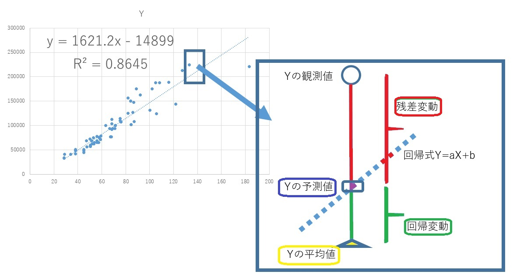
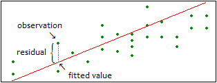

# 第７週：機械学習{#machinelearning}


```{r setup_chap7, echo=FALSE}
knitr::opts_chunk$set(cache=TRUE)
```

AI、人工知能という言葉が頻繁に（ひんぱん、たびたび）使われるようになっている。
実は、一般にAIという場合、そこには先週学んだ統計的検定や、今日から学ぶ機械学習の技術も含まれていることがほとんどである。


機械学習（きかいがくしゅう：machine learning）という言葉は聞きなれないかもしれないが、我々の日常生活においてはすでに多くの場面で使われている技術である。
たとえば、メールのスパム対策、クレジットカードの不正利用の検知、画像認識、 Amazonなどの商品レコメンデーション、医療診断、株式取引、顧客セグメンテーションなどなど、応用事例は数え切れない。

<iframe width="560" height="315" src="https://www.youtube.com/embed/ukzFI9rgwfU" frameborder="0" allow="accelerometer; autoplay; encrypted-media; gyroscope; picture-in-picture" allowfullscreen></iframe>

（英語の聞き取りが苦手であれば画面右下で字幕をONにしよう）


人間が、経験（というデータ）から学んで知識を獲得していくように、機械学習は蓄積されたデータから学んで知識を獲得する。ただし、機械なので、人間では処理しきれない大量のデータを一度にあつかうことができる。
一方、人間は知覚を通してものごとの特徴を把握するのが得意であるが、機械は人間の知覚ではとらえきれない特徴を見つけ出すことができる。他方で、人間が日常、簡単に行っていることが、機械にはまだ難しかったりする（たとえば、日本語でいう「空気を読む」ことは機械にはできないだろう・・・多分、まだ、しばらくは）。

機械学習は数学的な理論と、それをコンピュータで実現するための技術、そして大量のデータが揃って実現している。
この授業では、機械学習をコンピュータで実現するための技術を中心に、簡単な応用例を紹介する。


## データサイエンスの中核技術{#main_stream}

統計的検定は、どちらかというと小規模な（標本サイズがふた桁程度の）データの分析のために開発されてきた。
小規模データでは、意味のある差と、意味のない差をわけることが難しいが、伝統的な統計学では確率分布について仮定（前提）を立て、また厳密な分析手順を定めることによって、データにもとづく意思決定を可能にしていた。

一方、機械学習（きかいがくしゅう：machine learning）は比較的規模の大きなデータを対象とする。機械学習の目的は、データを**学習**（がくしゅう：learn）し、学習した結果（モデル）にもとづいて、新しく得られるデータから**予測**（よそく：predict）を行うことにある。機械学習は、データサイエンスの中核技術であり、応用範囲はきわめて広い。


## 学習{#classify_predict}

機械学習はデータから学習する技法であるが、どのように学習を行うかという観点（かんてん）から、大きく3つに分けられる。

1. 教師あり学習
2. 教師なし学習
3. 強化学習


### 教師あり学習{#supervised}


たとえば、選挙（せんきょ：election）でどの政党（せいとう：party）に投票（とうひょう：vote）するかを、有権者（ゆうけんしゃ：voters）の属性（ぞくせい）から予測したいとしよう。
ここで属性とは、年齢や性別、さらには学歴（がくれき）、年収、居住地などを表す。別の見方をすると、ある特定の政党に投票する人たちに共通の属性は何かを知ることでもある。
似たような属性を持つ個人は、投票する政党（あるいは投票行動）も似てくるだろうと考えるのである。

もしも10000人の有権者の投票行動（とうひょうこうどう）について、こうした属性が記録された**属性データA**があるとする。
また、一方、データAに登録された有権者について、過去に投票した政党名が**投票データB**としてある。
属性データAと投票データBの関係を学習するのが機械学習である。ここで、過去に投票した政党をラベルと呼ぶ。機械学習では、**ラベル**(label)と、さまざまな属性の関連性（かんれんせい）をデータから学習する。
属性データAから、投票データBという正解を導き出す規則（ルール）を発見するのが、**教師あり学習**(supervised learning)である。

このように学習した結果（学習モデルなどとよぶが、「モデル」については後述）ができると、新たに別の人々の**属性データC**が与えられたとき、データCに登録された有権者の属性情報から、彼らの投票政党（投票結果D）を予測できるようになる。こうした課題を**分類**（ぶんるい：classification）と呼ぶ。

一方、属性データAに登録された有権者について、その全員の年収についての情報が**年収データE**として得られたとする。
この場合、属性データAと、年収データEの関係を学習することができる。学習がうまくいけば、別の人々の属性データCから彼らの年収を予測できる。
たとえば、女性で数理系の大学院卒の場合、年収はどれくらいかを予想できる。
この課題は、どのラベル（政党）に属するかではなく、どれくらいの数値（年収）になるかを予想する課題である。
この課題を**回帰**（かいき：regression）という。

つまり、教師あり学習では、ある入力（属性データA）とすでにある出力（投票データBや年収データE）の関係をデータから学習し、この学習結果にもとづいて、新しい入力（属性データC）から、未知の（手に入っていない）出力（ラベルあるいは数値）を予測することを試みるのである。


### 教師なし学習{#unsupervised}

上で説明した教師あり学習では、学習対象となるデータ（属性データA）について、同時に政党データBや年収データEが与えられていた。
これに対して、**教師なし学習**(unsupervised learning)では、学習対象となるデータ（属性データA）以外には、なんのデータも与えられていない。

しかし、属性データAから、趣味（しゅみ）や好みを共有していそうな人々をグループ分けしたい。あるいは、今後、数年以内にカップルとなりそうなグループ、さらには、カップルとして相性のよいペアを見つけたい。今後、数年以内に破産しそうな人々のグループを見つけたい、数年以内に肥満になりそうな人々のグループを見つけ出したい。年収がいまの2倍になりそうな人々のグループを見つけたい、などなどの課題が考えられるだろう。いずれも、与えられたデータには正解が含まれていない。この正解を、与えられたデータだけから導き出すルールを見つけるのが教師なし学習である。

よく知られた例として、メールが迷惑（spam）かどうかを判定することがあげられる。
メールそのものには（当然であるが）「このメールは迷惑です」とか「このメールは迷惑メールではありません」などというラベルが含まれているわけではない。
教師なし学習では、受信メールの文章などの特徴から、迷惑か迷惑でないかを判断するために学習をおこなう。
（（もしも、迷惑メールとそうでないメールの過去データセットがはじめから与えられていて、そのデータから学習するのであれば、教師あり学習ということになる。ただし、迷惑メールはアンチウィルス対策ソフトによる検出を回避するため、文章表現を巧妙（こうみょう、うまく）に変えていくので、最初に一度学習したモデルを、いつまでもそのまま使っていては、メールが迷惑かどうかの判定は難しくなっていくだろう。））

また、やや特殊な例となるが、ある製造ラインにおいて不定期に不良品の割合が高まることを予測するのも、教師なし学習である。
この場合、製造機械（せいぞくきかい）や環境などからの属性（時間帯やモータの回転数、室温など）を入力とし、不良品の割合が増加する兆候（ちょうこう：signs）を予測することが期待される。これを異常検知（いじょうけんち：anomaly detection）という。


### 強化学習{#reinforcement}

強化学習は、教師あり学習に近いが、ラベルそのものは与えられない。
学習モデルは、ある状態（環境）において何らかの行動を取る（処理を行う）ことで、その行動（処理）に応じた報酬（ほうしゅう：reward）を獲得する。学習モデルは、その報酬を最大化することを自ら学んでいく。この過程で、予測精度を最大化する方法を獲得していくというのが、強化学習の基本的なアイデアである。

強化学習は、囲碁（いご）の世界チャンピオン（人間）に勝利したGooleのAlphaGoで使われているほか、自動運転技術(self-driving)などにも応用されている。

本書では、強化学習については説明しないが、興味のある読者は検索サイトで「AlphaGo」などをキーワードに調べてみるといいいだろう。


### 回帰とクラスタリング{#reg_clustring}

今週は、数値ないしラベルを予測する手法の代表として、回帰分析（かいきぶんせき：regression analysis）とクラスター分析を紹介する。
ただし、回帰分析もクラスター分析も、予測という観点からは、それほど精度は高くない。機械学習では、より予測精度の高い手法が多数考案されている。

しかし、分析手法をより高度な手法に変えるだけでは、予測精度を上げるのには一般には不十分である。
分析手法を適用する前に、入力となるデータの選別や調整などの前作業も非常に重要となる。
こうした作業については、次週の統計モデリングで紹介する。
まずは、データにモデルを当てはめるという考え方を学んでいく。


## モデル{#data_model}

教師あり機械学習では、一般にデータにモデルを当てはめて考える。
モデルとは、予測や分類の対象となる変数($y$)がどのように生成されるのか、その仕組み（しくみ：mechanism）を表現したものである。

たとえば $y = x_1 + x_2 + x_3$ は、予測ないし分類の対象である変数 $y$ の値（先に説明した例では政党データBや年収データE）が  $x_1,x_2,x_3$ 
という別の３つの変数（先の例では、属性データA）によって決まることを表している。ただし、場合によっては 
 $x_1,x_2,x_3$ のうち、$y$ にもっとも影響するのが $x_1$ で、次に影響度が強いのが 
 $x_3$ であり、$x_2$ の影響はそれほど強くないのかもしれない。
 この場合、 $y = 0.6 x_1 + 0.1 x_2 + 0.3 x_3$ のように、変数 $x_1,x_2,x_3$ のそれぞれに数値をかけて影響度を表す。
 この影響度を表す数値を係数（けいすう：coefficients）という。
 
このように、 $y$ が生成される仕組みを $y = 0.6 x_1 + 0.3 x_2 + 0.1 x_3$ などで表現したものが**モデル**である。

ただし、データサイエンスの分野で対象となるデータでは、変数 $y$ が実際にどのような仕組みで生成するかは分からないのが普通である。

また$y$ に影響するであろう変数をすべて手に入れることもできないだろう。つまり、本当は$x_4,x_5,x_6$ （属性データAであれば、親の財産とか、交友関係とか）のような変数の影響も考慮されるべきであるのだが、それらの変数は測定されていないか、あるいは、そもそも我々は、そういった要因の存在に気がついていないのかもしれない。

$y = 0.6 x_1 + 0.3 x_2 + 0.1 x_3$ と分析者が考えたモデルは、現実に$y$が決定される仕組みを正しくは反映していないのかもしれない。正しくないのかもしれないが、高い精度で$y$を予測ないし分類することができれば、現実の課題を解決するのに役立てることができる。

そこで、モデル式に、$\epsilon$ （イプシロン、とよむ）という**誤差**（ごさ：error）を加えて考える。

$$
y = a_1 x_1 + a_2 x_2 + a_3 x_3 + \epsilon
$$

$y$ に影響する変数も他にもあるだろうし、かつ手に入っている $x_1,x_2,x_3$ さえ、そもそも正確に測定されているとは限らない。そのため$y$ との間に誤差が生じていると考えるのである。


機械学習では $y = a_1 x_1 + a_2 x_2 + a_3 x_3 + \epsilon$ というモデルを立て、$y$ を予測するためにもっとも有効な係数（けいすう：coefficients） $a_1,a_2,a_3$ を推測する。ここで係数 $a_1,a_2,a_3$ を**パラメータ**と表現する。つまり、機械学習ではパラメータの推定が非常に重要になる。
機械学習とは、単純にいうと、まず $x_1,x_2,x_3$ など $y$ に関係ありさそうな変数を選び、これらの影響度を表す $a_1,a_2,a_3$ を推測し、さらに、できるだけ誤差 $\epsilon$ を小さくして $y$ を予測する手法（しゅほう）だといえる。

機械学習のこうした発想を、もっともシンプルに体現（たいげん、表現）しているのが、次に紹介する**回帰分析**である。
回帰モデルは数値の予測を行う手法であるが、応用として、分類（たとえばYesかNoか、いずれのラベルかを予測すること）もできる。


以下、今週は教師あり学習である回帰分析（回帰モデルともいう）について、やや詳細に説明し、最後に教師なし学習の代表例であるクラスター分析について簡単に紹介する。

ただし、現実のデータにもとづいて予測を行う場合、通常の回帰分析やクラスター分析では十分な精度を得られないことが多い。
このような場合、より性能の高い手法を利用することになるが、手法だけでなく、データ（変数）の選択や設定、さらにパラメータの調整なども、分析においては重要な作業となる。
これらについては、次週の「統計モデリング」で解説する。


## 回帰モデル{#regression}

ある変数と別の変数に相関がある場合、一方から他方を予測するモデルを作成することができる。機械学習では、手もとのデータから、予測すべき変数と、それに影響を与えている変数の関係を学習し、この結果を使って新しいデータの予測を行うことが可能である。これを回帰モデルという。回帰モデルは、教師あり学習の代表的な手法である。


### 相関{#correlation_for_linear_model}

（数式について小テストで出すことはない）

相関係数は、ある変数と別の変数の関係をあらわす指標（しひょう：indicator）であった。

[外部サイト：ウィキペディア：相関係数](https://ja.wikipedia.org/wiki/%E7%9B%B8%E9%96%A2%E4%BF%82%E6%95%B0){target=_blank}


いま一方の変数を y とし、他方を x とする。もしも２つの変数が*完全に*相関しているのであれば、x の値が定まると、y の値も自動的に定まる。
$y = a x$ という関係ならば、ある $x$ の値を $a$ 倍すると $y$  の値になるとわかる。


一方、y と x の関係が弱い場合、x の値が定まっても y の値が一意に定まることはない。
それでも、x 値から y の値をある程度は予測することが可能と考えられる。
そこで $y = a x + \epsilon$ という式を考える。
$\epsilon$ は **誤差** （ごさ：error）である。
誤差には、まず測定（そくてい：measure）する際に生じる不正確さ（長さを測るとき目盛りをおおざっぱに読み取ってしまうとか）がある。
他に、データとして得られていない他の要因の影響もこの場合、誤差に含まれる。たとえば、テストでどれだけ高得点をとるかを予測するのに必要なデータは何だろうか？
ある生徒の毎日の勉強時間は重要だろうが、その他にもテストの成績に与える影響はあるだろう（前日の睡眠時間とか）。要するに、テストの得点に影響を与えるものは多数あるだろうが、それらを全部知ることも、仮に知っていたとしても、すべてを正確に記録して取っておくことは不可能である（可能な限りデータは集めるべきであるが）。こうした記録されていない影響も誤差には含まれていると考えられる。


一般に、誤差はまったくランダムな値と想定する。ランダムという意味は、誤差は平均すると 0 になるということである。
すなわち $y$ は $x$ の値を $a$ 倍した結果に、 $0$ から大きくははなれていない値が加わった結果と考えるのである。

このように考えて変数 $y$ の予測を行う手法を**回帰分析**（かいきぶんせき：regeression）、あるいは回帰モデルという。
回帰分析では、誤差として正規分布を想定することが多い
（ただし、回帰分析を適用するにはデータの誤差、あるいは変数の分布が正規分布でなければならないということはない）。


## 回帰分析{#linear_regression}

回帰分析では、$y$ を**応答変数** （おうとうへんすう：response variable）$x$ を**説明変数** （せつめいへんすう：predicator）という。応答変数を従属変数（じゅうぞくへんすう）、説明変数を独立変数（どくりつへんすう）と呼ぶこともある。
特に機械学習の文脈では、説明変数を**特徴量** （とくちょうりょう：features）と表現することも多い。
また $y = a x + \epsilon$ を**回帰式**（かいきしき）という。
ただし、一般には  $y \sim b + a x$ というふうに、チルダ記号（〜）を使って書く（$\epsilon$ は書かない）。
チルダ記号（〜）を使うのは、誤差 ($\epsilon$) が別に存在する($y = b + a x + \epsilon$) ため、イコールとはならないのである
$b$ は**切片**（せっぺん：intercept）であり、$x$ が 0 の場合の $y$ の値になる。また $a$ は**係数**（けいすう：coefficient）という。回帰分析の目的は $y$ を予測するのに役立つ切片 $b$ と係数 $a$ を推定することにある。


具体例を使って話を進めよう。


賃貸住宅（ちんたいじゅうたく）では、家賃（やちん）はその物件の間取り（広さ）と相関があるだろう。
そこで家賃を応答変数、広さを説明変数にした回帰モデルが考えられる。授業用に用意したデータがあるので、これを読み込む。


```{python rent}
import pandas as pd
df = pd.read_csv("https://infoart.ait231.tokushima-u.ac.jp/DS/data/rent.csv")
df
```


```{r echo=FALSE, eval=FALSE}
library(tidyverse)
library(readxl)
rent <- read_excel("data/rent.xlsx")
```

データには3つの列があるが最初の列 (`No.`) は物件の番号である。次の `square` （平米、へいべい）が物件の面積であり、`rent` が家賃である（日本円）。ここでは、`rent` と`square` の関係を学習させ、`square` から`rent` を予測したい。

こうした2変数のデータがある場合、最初に行うべきは散布図を描いてみることである。

まず、実際に相関が認められるかを確認してみよう。散布図で確認し、念のため相関係数も求めてみる。

```{python rent_scatter}
import matplotlib.pyplot as plt
import seaborn as sns
sns.scatterplot(x = 'square',y='rent', data = df)
```


```{python rent_scatter_show, echo=FALSE}
plt.show()
```

```{r echo=FALSE, eval=FALSE,corr}
library(tidyverse)
rent %>% ggplot(aes(x = square, y = rent)) + geom_point()
rent %>% select(square,rent) %>% cor()
```

散布図を見ると、`square` と`rent` にははっきりと正の相関が認められる。
相関係数は以下のようにして求められる。


```{python rent_scatter_corr}
df.corr()
# No.はただの連番なので相関係数を求めても意味がないので次のようにしてもよい
# df.drop("No.",axis=1).corr()
```


`square` と`rent` の相関係数は約0.93であり、きわめて高い（相関係数が-1.0から1.0の間の数値であったことを思い出そう）。

ただし、`square` （平米）がある一定の水準（x軸の真ん中あたり）を超えると、家賃`rent` がやや高くなる物件があることもわかる。また、もっとも広い物件（180平米）の家賃がやや安いことなど、気になる点もあるが、これらの点については保留（ほりゅう、むし）して、回帰分析を適用してみよう。


さて、回帰式は $\text{家賃} \sim b + a \text{平米}$ となる。ちなみに、この式は直線を表している。単純な回帰問題は、データをよく表す直線を求める問題であるといえる。

Pythonで回帰問題を解くには **statsmodels** ライブラリや**scikit-learn**ライブラリ（サイキットラーンと読む）を利用するのが簡単である。ここでは**statsmodels** を利用する。PythonのインストールにAnacondaを使っていない場合は、コマンドプロンプト（ターミナル）で `pip3 install statsmodels ` を実行して、インストールしておこう。


最初に**statsmodels** ライブラリを使うことを `import` で宣言し、続いて回帰式を指定する。

```{python ols}
import statsmodels.formula.api as smf
model = smf.ols(formula = 'rent ~ square', data=df)
results = model.fit()
```


`smf.ols()`が回帰分析を実行する関数である。
`rent ~ square` は、線形モデルを表すのによく使われる表記方法である。$y = a x$ に対応する（切片 $b$ と係数 $a$ は自動的に加えられるので、わざわざ指定しない）。`rent = square` と指定せずチルダ記号（〜）を使うのは、誤差 ($\epsilon$) が別に存在する($y = b + a x + \epsilon$) ため、イコールとはならないのである（回帰式には含まれていた誤差も、上のコードでは指定していない）。

線形モデルを指定したあと、`fit()`を適用すると、係数と切片の推定が行われる。
結果を確認するには `summary()` を使う。


```{python ols2}
results.summary()
```


非常に多くの情報が出力されているが、まず、係数（と切片）の推定値を確認しよう。

|           | coef      | std err   | t        | P>t    | [0.025 | 0.975]    |
|-----------|-----------|----------|--------|--------|-----------|-----------|
| Intercept | -1.49e+04 | 5939.032 | -2.509 | 0.015  | -2.68e+04 | -3041.049 |
| square    | 1621.1734 | 78.996   | 20.522 | 0.000  | 1463.453  | 1778.894  |


`square` の係数（`coef`）は1621.1734と推定されている。` std err`は標準誤差で、推定された係数は確定値ではなく、誤差があることを示している。tは、前の週に学習した ｔ 分布の値である。ｔが、推定された係数を標準誤差で割った値であることがわかるだろうか。

この場合、係数の平均値を標準誤差で割るというのは、推定された平均値から 0 （0は係数に効果がないことを表す）を引き、これに推定された標準偏差をデータ数の平方根で割った値で割ることを意味する（前の週のｔ分布の説明を参照されたい）。このｔ値が大きいのか小さい（普通）なのかは、ｔ値の確率で求める。ｔ値の確率は、Pythonでは以下のように求められる。ｔ分布は自由度で分布が決まるが、ここの回帰分析で自由度は、データ数から説明変数の係数１つと切片１つ（つまり２）を引いた数になる。上の出力では `Df Residuals` という項目にある 66 である。


```{python estimated_t_p}
import scipy.stats as ss
1 - ss.t.cdf(20.522, 66)
```

このp値が 0.05 よりも小さいならば、帰無仮説である「係数は0である」を棄却し、対立仮説である「係数は0ではない」を採択することになる。係数が0というのは `rent = 0 x square ` ということで、広さは家賃にまったく関係しないことになるので、その説明変数（ここでは`square `）に意味がないことになる。
上の分析結果では `square`のｐ値は0である（0にちかい）ため、帰無仮説は棄却され、対立仮説が採択される。つまり、推定された係数に意味があると解釈される。

結局、回帰式として $\text{家賃} \sim -14899 + 1621 \times x$ が推定されたことになる。ここで説明変数の係数は、`square` が1単位（1平米）増えると、`rent` が1621円増えることを意味している。ちなみに、切片はマイナスの値になっているので、そのまま解釈すると、広さが0のときは家賃がマイナス、すなわち逆に家賃を返してもらえると解釈できそうにみえる。しかし、これは意味をなさない。

回帰分析では、データから学習して係数を推定するが、説明変数（この分析では `square`）の範囲が 0 から離れている場合、推定された切片に積極的な意味を見出すことはできない。ちなみに、このデータで説明変数の範囲は 28平米から 183平米である。 
xが0のとき、yも0となることが確かであれば、回帰分析で切片を0として分析することも考えられるが、家賃と広さの関係の場合、そもそも広さが0の物件を貸し出すという状況は考えられないので、切片を0とすることが、必ずしも妥当ではないだろう（たとえば、バネに重りを下げる場合に重さをx、バネの伸び量をyとするような実験では切片を0に固定することには意味があるだろう）。


データサイエンスにおいて、データを表現した式（あるいは考え方）を**モデル**という。データサイエンスはデータに対してモデルを当てはめるための理論と技術であるともいえる。ここで扱っている回帰問題は、データを直線で表すモデルだと言える（**回帰モデル**ともいう）。以下に、散布図にいくつかの直線を引いてみた。


```{python poly_regression_1, echo=FALSE,eval=FALSE,show=FALSE}
from sklearn.linear_model import LinearRegression
from sklearn.preprocessing import PolynomialFeatures
polynomial_features = PolynomialFeatures(degree = 3)
X_poly = polynomial_features.fit_transform([df['square']])
#X_poly = polynomial_features.fit_transform(df['square'].values.reshape(-1,1))
poly_reg = LinearRegression()
poly_reg.fit(X_poly, [df['rent']])
# poly_reg.fit(X_poly, df['rent'].values.reshape(1,-1))
pred_y = poly_reg.predict(X_poly)
plt.scatter(x='square',y= 'rent', data= df, alpha=0.2)
plt.plot(df['square'], pred_y.reshape(-1,1), c='r')
order = 10
estimated_parameters = np.polyfit(df['square'], df['rent'], order)
estimated_curve = np.poly1d(estimated_parameters)
plt.xlabel("x")
plt.ylabel("y")
plt.plot(df['square'].sort_values(), estimated_curve(df['square'].sort_values()))
plt.scatter(df['square'], df['rent']);
```

```{python poly_regression_1_show, eval = FALSE, echo=FALSE,show=FALSE}
plt.show()
```

```{r echo=FALSE}
library(readxl)
rent <- read_excel("data/rent.xlsx")
rent_lm <- lm(rent ~ square, rent)
```

```{r echo=FALSE}
rent2 <- rent %>% mutate(predicted = predict(rent_lm),
                        residuals = residuals(rent_lm))

rent2 %>% ggplot(aes(x = square, y = rent)) + geom_point(size=3) +
  geom_abline(slope = rent_lm$coefficients[2], intercept = rent_lm$coefficients[1], alpha=0.6)  + geom_abline(slope = rent_lm$coefficients[2] *0.8, intercept = rent_lm$coefficients[1] - 1, linetype = 2) + geom_abline(slope = rent_lm$coefficients[2] * 1.2, intercept = rent_lm$coefficients[1] + 3, linetype = 3)
```

この直線を表す式には誤差が入っていないため、現実に観測されたデータ（黒い点）のほとんどは、この直線の上にはのっていない（重なっていない）。
いずれの直線も、現実のデータの上か下を通り過ぎている。その意味では、どの直線もデータを完全に表していない。しかし、あえて現実のデータに近いと表現できそうな直線はどれだろうか？
回帰問題では、散らばったデータ点の間を縫うように通る直線が、データをよく表現していると考える。それは、回帰直線とデータ点との誤差が総じて最小になるからである。

ちなみに、直線ではなく、曲線を使えば、このデータにもっとフィットさせることができると思うかもしれない。

```{python regplot}
import seaborn as sns
sns.regplot(df['square'], df['rent'], order =3)
plt.ylim(0, 300000)
```
```{python regplot_show, echo=FALSE}
plt.show()
```

```{python lineplot}
sns.scatterplot(df['square'], df['rent'])
sns.lineplot(df['square'], df['rent'])
```

```{python lineplot_show, echo=FALSE}
plt.show()
```


確かに、直線とくらべるならば上の２つのグラフはどちらもデータの点に近くなっているだろう。しかし、これは有用ではない。
なぜなら、この曲線は、いま、てもとにあるデータに当てはめられすぎているため、新しく別のデータ $x$ が得られても、それ対応する $y$ の予測を大きく外す可能性があるからである。データサイエンスの分野では、これを**過学習**（かがくしゅう：overfitting）と呼び、過学習を避けるためにさまざまな工夫を行なっている（次週の統計モデリングでより詳しく説明する予定である）。

一般には、シンプルな直線でデータへの当てはめが可能であれば、その方が汎化性能（はんかせいのう：generalization performance ）が高い（つまり、新しいデータを正しく予測できる可能性が高い）。

誤差が最小になるような直線を選ぶ（切片と係数を推定する）方法を**最小二乗法**（さいしょうじじょうほう：Ordinary Least Squares regression, OLS）という。
また応答変数との誤差を最小化するということは、応答変数の値を「答え」として利用するのだから、教師あり学習ということになる。


### 線形{#what_linear}

（数式について小テストで出すことはない）

データサイエンスの文脈で、しばしば**線形**（せんけい：linear）という言葉が出てくるが、これは係数について線形関数であることを意味する。
たとえば、あとで説明する重回帰分析（じゅうかいきぶんせき：multiple regression）では、説明変数が複数ある。つまり、$y = b + a_1 x_1 + a_2 x_2 \dots a_n x_n$ となるので、推定すべき係数 $a$ も複数ある。このとき $x_i$ には、別の $x$ の自乗や対数、平方根であっても（つまり $y = b + a_1 x + a_2 x^2 + a_3 log(x)$ は）**モデルとしては線形**である。

[外部サイト：ウィキペディア：線形方程式](https://ja.wikipedia.org/wiki/%E7%B7%9A%E5%9E%8B%E6%96%B9%E7%A8%8B%E5%BC%8F){target=_blank}


### 最小二乗法{#ols}


最小二乗法について簡単に説明しよう。

（数式について小テストで出すことはない）

いま、回帰式が $f(x) = a x + b$ だとする。この $x$ にデータのある値を代入すると、回帰式による予測値が求められる ($\hat{y} = f(x)$)。ちなみに $\hat{y}$ はワイハットと読み、$y$ の予測値（よそくち：predicted values）という意味である。実際のデータから予測値を引いた値（誤差）を、**残差**（ざんさ：residuals) という。ちなみに、標準的な回帰分析においては、残差が正規分布にしたがうとして分析されることが多いが、、一般化線形モデル（いっぱんかせんけいもでる）という枠組みを使うと、誤差がポアソン分布などにしたがうと考えた回帰モデルも利用できる。





観測値のすべてについて残差を求めて自乗し、すべてを合計した値を**残差平方和**（ざんさへいほうわ：residual sum of squares, RSS）という。

$$
\sum_i^N (y - \hat{y})^2
$$

これは、観測データと、回帰式との不一致（ふいっち）を表す指標（しひょう）である。この合計値が小さいほど回帰式は観測データによく適合（てきごう：fitted）していると評価される。これをデータサイエンスでは**当てはめ** (fitting)が良いなどと表現することが多い。


最小二乗法（さいしょうじじょうほう：Ordinary Least Squares regression, OLS）は、この残差の自乗和が最小になる**傾き** $a$ と**切片** $b$ を選ぶ方法である。




[外部サイト：ウィキペディア：最小二乗法](https://ja.wikipedia.org/wiki/%E6%9C%80%E5%B0%8F%E4%BA%8C%E4%B9%97%E6%B3%95){target=_blank}

傾きと切片のようにデータから推定される未知数を**パラメータ** (parameter)という。機械学習では、モデルを構築（こうちく：build）し、予測の精度を最大にするパラメータを推定する手法だともいえる。


### モデルの評価{#model_evalutes}

データにモデルを当てはめ、パラメータを推定した結果については、その適合の良し悪しが評価されなければならない。
一般にデータに適切なモデルは一つとは限らない。あるいは、本当に適切なモデルというのは、結局は分からない。
データサイエンス（あるいはAI）で行うのは、パラメータを推定する方法を調整しつつ、複数のモデルを構築し、
その中から目的（たとえば、家賃の予測）にもっとも役立つモデルを選ぶことである。

モデルの構築と、最適なモデルの選択を**統計的モデリング**などと表現するが、これについては第８週で解説する。

なお、伝統的なデータ分析では、回帰係数が適切かどうかを判定する尺度として、**決定係数**（けっていけいすう： coefficient of determination）が使われることが多い。
これは、回帰式による予測と、実測値のズレの大きさを表す指標であり、0 から 1 の範囲の数値として求められる。先のPythonの出力では `R-squared:0.865` と出力されている。

決定係数は残差平方和から計算される数値なのだが、残差平方和の大きさはデータによって異なるので相対的にしか評価できない（残差平方和が大きいか小さいかはデータ次第である）。
一方、決定係数は 1 に近いほど、回帰式の予測が観測値に近いことを表す。そのため、評価がしやすく、しばしば利用されている。

ただし、決定係数が1に近くとも、新しいデータに対して予測を行ってみると、必ずしも良好な結果が得られるわけではない。
また機械学習では、決定係数ではなく、残差平方和そのものを評価の基準としていることが多い（後述する）。


### 決定係数{#coefficientofdetermination}

決定係数について簡単に説明しよう。

（数式について小テストで出すことはない）

以下の式で求められる数値を**残差平方和**（ざんさへいほうわ：residual sum of squares）という。
<!--最小二乗法では、残差平方和を推定に利用したが、モデルの適合についても、残差平方和が使われる。残差平方和は次の式で求められる。-->


$$
\sum_{i=1}^n (y_i - \hat{y_i})^2
$$

$\hat{y_i}$ は回帰モデルから予測された観測値$i$ の値である。
一方、入力データの応答変数のすべてについて応答変数の平均値を引く。この値を自乗して合計した値を**全平方和**（ぜんへいほうわ：Total sum of squares）とよぶ。

$$
\sum_{i=1}^n (y_i - \bar{y})^2
$$

回帰モデルによる予測値から、応答変数の平均値を引いて、自乗して合計する。これを**回帰平方和** （かいきへいほうわ：Regression sum of squares）と呼ぶ。


$$
\sum_{i=1}^n (\hat{y_i} - \bar{y})^2
$$

ここで $\text{全平方和} = \text{回帰平方和} + \text{残差平方和}$ が成り立っていることに注意されたい。

ここで全平方和に占める回帰平方和の割合を**決定係数**$R^2$と呼び、この割合が大きい場合、回帰モデルの予測精度が高いとみなす。


\begin {align}
        R^2 &= \frac{ \sum_{i=1}^n (\hat{y_i} - \bar{y})^2} {\sum_{i=1}^n (y_i - \bar{y})^2} \\
            &= 1- \frac {\sum_{i=1}^n (y_i - \hat{y})^2 } {\sum_{i=1}^n (y_i - \bar{y})^2 } \\
\end {align}


割合であるから $R^2$ は 0.0 から 1.0 の範囲の数値になり、値が大きいほど、回帰モデルの当てはめが良いと判断される。
ただし、観測値の数と説明変数の数が近いと、決定係数は無条件に良くなることが知られている。
回帰モデルでは、応答変数とは無関係な説明変数であっても、モデルに組み込むと全体として決定係数が1に近づくという性質がある。
そこで、説明変数の数を評価に組み込んだ**自由度調整（修正）済み決定係数** （じゆうどちょうせいずみけっていけいすう：adjusted coefficient of freedom） という指標が使われる。


\begin {align}
        R^2 &= 1- \frac{ \frac{\sum_{i=1}^n (y_i - \hat{y})^2} {n - k - 1} } { \frac{\sum_{i=1}^n (y_i - \bar{y})^2} {n - 1}}   \\
\end {align}


先の決定係数は平方和の割合であったが、自由度調整済み決定係数においては、分母が観測値の数（と1を足した値）で、また分子が観測値の数から説明変数の数（と1を足した値）で割られてる。
つまり、自由度調整済み決定係数は平均平方和の割合であり、説明変数あたりの平均的な効果を見ているわけである。


## 重回帰モデル{#multi}

**重回帰モデル** （じゅうかいきもでる：multiple regression model）とは、前節の回帰モデルで説明変数が２つ以上になった場合を指す。これに対して、説明変数が1つの場合を **単回帰モデル** と呼ぶことがある。
説明変数が $N$ 個あるならば、モデルは $Y = a_1 \, X_1 + a_2 \, X_2 + \dots + a_n \,  X_n$ ということになる。
重回帰分析では、応答変数を説明する変数の選択と*交互作用*（こうごさよう：interaction）の検討が重要になる。応答変数を「一日あたりのビールの消費量」とした場合を検討しよう。
まず、説明変数の候補としては「その日の気温」、「湿度（しつど）」、「天候」が考えられるとする。この3つの変数は、もちろんビールの消費量にそれぞれ影響を与えるだろう。しかしながら、この3つの中で消費量への影響力の強さを比較すると、「気温」＞「天候」＞「湿度」の順になり、特に最初の２つの影響が大きいと確信しているとする。
これは、応答変数を予測するのには「気温」と「天候」の２つだけでも十分に役に立つと考えていることになる。このように説明変数を選ぶことが、変数選択である。

一方、気温だけが高い日よりも、同時に湿度も高い日のほうが、ビールの売上はあがるかもしれない。これは相乗効果（そうじょうこうか：synergy effect）だが、重回帰では交互作用という。


ただし、複数の説明変数を使う場合、説明変数どうしの相関が高いすぎるのは好ましくない。
賃貸住宅の場合、家賃に影響がありそうな要因として、「駅から徒歩での時間」と「駅からの距離」があげられるだろう。
常識的には、「駅から徒歩での時間」と「駅からの距離」には強い相関があるだろう。説明変数間に強い相関がある場合、**多重共線性**（たじゅうきょうせんせい：multicollinearity） という問題が生じることがある。変数の間に多重共線性があると、パラメータの値を一意（いちい）に求めることができないことがある。
そのため、相関の高い説明変数は、どちらかを取り除くか、あるいは統合してしまう（つまり、相関の高い変数から別の第3の変数を作り出すなどする）。


重回帰分析の例として、米国ボストン市郊外における地域別の住宅価格のデータセットを利用する。これが機械学習の学習ツールとしてしばしば利用される有名なデータセットである。


```{python boston_housing }
import pandas as pd
df = pd.read_csv('https://archive.ics.uci.edu/ml/machine-learning-databases/housing/housing.data',
                 header=None, sep='\s+')
df.columns = ['CRIM', 'ZN', 'INDUS', 'CHAS', 'NOX', 'RM', 'AGE', 'DIS', 'RAD',
              'TAX', 'PTRATIO', 'B', 'LSTAT', 'MEDV']
df.head()
```

14個の変数があるが、それぞれについて簡単に説明する。

| 変数名  | その内容                                                       |
|---------|----------------------------------------------------------------|
| CRIM    | 人口 1 人当たりの犯罪発生数                                    |
| ZN      | 25000 平方（フィート）以上の住居区画の占める割合                  |
| INDUS   | 小売業以外の商業が占める面積の割合                             |
| CHAS    | チャールズ川によるダミー変数 (1: 川の周辺, 0: それ以外)        |
| NOX     | NOx の濃度                                                     |
| RM      | 住居の平均部屋数                                               |
| AGE     | 1940 年より前に建てられた物件の割合                            |
| DIS     | 5 つのボストン市の雇用施設からの距離 (重み付け済)              |
| RAD     | 環状高速道路へのアクセスしやすさ                               |
| TAX     | 10000 ドルあたりの不動産税率の総計                           |
| PTRATIO | 町毎の児童と教師の比率                                         |
| B       | 町毎の黒人 (Bk) の比率を1000(Bk – 0.63)^2 で表した指標|
| LSTAT   | 低所得層の人口割合 (%)                         |
| MEDV    | 家屋の中央値（単位千ドル）                   |


ここで、`MEDV ` を応答変数($y$)とし、その他13個を説明変数を使うモデルを構築する。


```{python boston_housing_pls}
import statsmodels.api as smp
X = df.drop('MEDV', 1)
X = smp.add_constant(X)
Y = df['MEDV']
model = smp.OLS(Y, X)
result = model.fit()
result.summary()
```


出力の係数表の P 値から、`MEDV` に影響のある変数は、`CRIM` と `ZN` 、`CHAS` 、`NOX` 、`RM`、`DIS`、`RAD`、`TAX`、`PTRATIO`、`B`、`LSTAT` の11個ということになる。
たとえば、`CHAS` の係数は2.6867とある。`CHAS`はチャールズ川の周辺の住宅であれば 1 さもなければ 0 が値として記録されている。したがって、他の（説明変数として有用な）11個の変数の条件がまったく同じで、川の周辺かどうかという1点だけが異なる物件があった場合、川の周辺にある家屋（の中央値）は、2686ドル高いと予想されることになる。

重回帰分析において、応答変数の予測に役立つ説明変数を選択する手法については、次章で扱う統計モデリングで重要な課題であり、詳しく説明する。


### 交互作用{#interacton}

（数式について小テストで出すことはない）


説明変数が複数ある場合、組み合わせによる相乗効果（そうじょうこうか：synergy effect）が考えられることがある。

たとえば、喫煙者（きつえんしゃ：smoker）は非喫煙者に比べて肺ガンの発症（はっしょう、発病）リスクが高いが、喫煙者で飲酒（いんしゅ）量の多い者では、肺ガン発症リスクがさらに高まると考えられている。これを**交互作用**と呼ぶ。


二つの説明変数 $x_1$ と $x_2$ 、そして、その交互作用を考慮した回帰分析は次のモデルで表される。２つの変数を掛け算した値と、その係数が追加される。


$$
y \sim b + a_1 \,  x_1 + a_2 \,  x_2 + a_3 \, x_1 \, x_2
$$

仮に3つ変数がある場合、それらすべての交互作用を検討するならば、以下のモデルとなる。


\begin{align}
y \sim b + a_1 \, x_1 + a_2 \,  x_2 + a_3 \, x_3 + 
           a_4 \, x_1 x_2 + a_5 \,  x_1 x_3 + a_6 \,  x2 x3 + 
		   a_7 \,  x_1 x_2 x_3
\end{align}

ただし、説明変数が複数ある場合に、必ず、こうした交互作用をモデルに組みこなければいけないということはない。

なお、因果（いんが、結果と原因）の観点からすると、飲酒量が増えたからといって、かならず肺ガンになるわけではない。つまり飲酒が直接的に肺がんのリスクを高めるとはいえない。
実際には、飲酒量の多い者は一般にヘビースモーカーであるということである。この場合、喫煙は**交絡**（こうらく：confounding）因子と呼ばれる。交絡因子は、原因と相関を持ち、結果とは因果関係がある（飲酒と喫煙は相関し、喫煙は肺ガンのリスクを高めるが、飲酒と喫煙に相関とは別に、因果の関係があるわけではない）。


### ダミー変数{#dummy_variables}

重回帰モデルでは、説明変数にカテゴリ変数を加えることができる。
高校生の体重を身長から予測しようとするのであれば、性別が考慮されるべきであろう。
そこで、「女」「男」「どちらでもない」の3つの水準からなるカテゴリ変数をモデルに投入するわけだが、
モデルを考えるのであれば、次のようになるだろう。

$$
\text{体重} \sim b + a_1 \times \text{身長} \times a_2 \text{性別}
$$

ただし、性別はカテゴリ水準なので（数値ではないので）、ここままではこのモデルを計算できない。
そこで、カテゴリ変数は数値化する。もっとも簡単な方法は、該当する水準には1を、それ以外には0をあてはめることである。

| 女 | 男 | 他 |
|----|----|----|
| 1  | 0  | 0  |
| 0  | 1  | 0  |
| 0  | 0  | 1  |


水準が0か1に置き換えられたカテゴリ変数を、**ダミー変数**(dummy variable)という。また、機械学習の文脈では**ワンホットエンコーディング**(one hot encoding)ともいう。

一般にカテゴリ変数をダミー変数に置き換える作業は、分析者がなにもせずともソフトウェアの方で勝手に実行してくれるのだが、
機械学習でよく使われるPythonの**scikit-learn**ライブラリでは、分析者があらかじめダミー変数に置き換えることはっきりと指定しておく必要がある）。
なお、Anaconda以外でPythonの環境を整えた受講生は `pip3 install scikit-learn` を実行して **sklearn** (scikit-learn)ライブラリをインストールしておくこと。


ただし、回帰モデルではダミー化（ワンホットエンコード）された変数はそのまま使えない。
一般にダミー変数を設定する場合、そのうち１つの水準を省略される。たとえば、次の例では女という水準が消えている（通常は、これもソフトウェアが自動的に設定するが、注意が必要である）。


| 男 | 他 | 
|----|----|
| 1  | 0  |
| 0  | 1  |


これは「女」というデータが消されたということではない。女性の平均身長が基準値（ベース）と解釈され、これに「男」あるいは「他」という属性の被験者の場合に
どれくらいプラスないしマイナスがあるかが推定されるのである。

すると、回帰分析の係数として、次のような結果が示される。


| 身長 | 0.4 |
|----|----|
| 性別 | 男 0.5 |
| 性別 | 他 0.2 |


これは、身長が1センチ伸びるごとに、体重が 0.4 キロ増えることを意味する（実際にそういう研究結果があるわけではない）が、
これに加えて、性別が（女性ではなく）「男」だと、さらに体重が 0.5 キロのプラスとなり、また（女性ではなく）「他」の場合だと 0.2 キロ増えることを表してる。
ダミー変数化された分析で、係数表に表示されていない水準は、基準値となっているのである。これを**参照水準**（さんしょうすいじゅん：reference level）などとよぶ。


伝統的な統計学の分野では、数値の変数とカテゴリ変数の両方を含むモデルを**共分散分析**（きょうぶんさんぶんせき：analysis of covariance）と呼ぶ場合もある。


## ロジスティク回帰モデル{#logistic}


前節の回帰モデルでは、応答変数が実数であった。回帰モデルは、応答変数がカテゴリ変数の場合に拡張することができる。特に、応答変数が２値の場合はロジスティク回帰モデルといい、応用範囲がきわめて広い。２値とは、たとえば、内閣を「支持する」あるいは「支持しない」、検査で「陽性positive」あるいは「陰性negative」、試みが「成功」あるいは「失敗」など、水準が2つに限定されたカテゴリ変数のことである。応答変数と説明変数の関係をデータから探るので、**教師あり学習** モデルということになる。ロジスティク回帰モデルの目的は、応答変数を**分類** することにある。

二値の応答変数を扱う場合、ロジスティク回帰モデルでは一方に数値の 1、他方に 0 を割り当ててるのが一般的である。すなわち説明変数から、応答変数が 1 となるか 0 となるかを予想する。
ただし、ロジスティク回帰モデルが実際に予測するのは、応答変数が 1 となる確率である。


住宅ローン（housing loan）を例にとろう。ここで借り手がデフォルト（返済不能）になるかどうかを予想したいとする。ここで返済不能(defaul)を1とし、返済を0とする場合、ロジスティク回帰分析は、ある顧客がデフォルトになる確率を求める。この確率が 0.5 を超えているのであれば 1（デフォルト）、さもなければ 0 （返済） と予測する。
確率であるので、その値は 0 から 1.0 の範囲でなければならない。ここでは実際に、ロジスティック回帰分析を実行し、出力の解釈などについて説明しよう。


### ロジット関数{#logit}

（数式について小テストで出すことはない）

ある個体（たとえば借り手）について、複数の測定値（性別、年収、学歴など）が記録されており、これを $x_1, x_2, \dots,  x_n$ と表そう。そして、その個体について 1 となる（返済不能となる）確率を $z$ とする。重回帰モデルで $z = b + a_1 x_1 +  a_2 x_2 \dots +  a_n x_n$  としたいところだが、このままでは $z$ が確率として 0 から 1 の間に収まることが保証されない。

ところが、この式を以下の式にすると確率としての $p$ が 0 から 1.0 の間の数値におさまさる。
この変形を行う関数を**ロジスティク関数**あるいはシグモイド関数という。

$$
p = \frac{1}{1+e^{-z}}
$$

Pythonでロジスティック関数を確認してみよう。


```{python sigmoid}
import numpy as np
import matplotlib.pyplot as plt

# -6, 6 の範囲を0.1間隔でとった配列
z = np.arange(-8, 8, 0.1)
# xにロジスティック関数を適用する
p = 1 / (1 + np.exp(-z) )
# グラフの設定
plt.plot(z, p) 
plt.xlim(-6, 6) 
plt.ylim(-0.1, 1.1) 
plt.grid() 
```

```{python sigmoid_show, echo=FALSE}
plt.show()
```


```{r echo=FALSE, eval=FALSE,mtcars1}
mtcars %>% ggplot(aes(x=mpg, y=vs)) + geom_point() 
```

ロジスティック関数を適用するとY軸のPの範囲が 0 から 1.0 になっているのが確認できるだろう。

```{r echo=FALSE, eval=FALSE,mtcars2}
mtcars %>% ggplot(aes(x=mpg, y=vs)) + geom_point() + 
  stat_smooth(method="glm", method.args=list(family="binomial"), se=FALSE)
```

この関数を回帰モデルに応用することを考える。
まず、重回帰モデルが以下のように表されるとしよう。


$$
z = b + a_1 x_1 +  a_2 x_2 \dots +  a_n x_n
$$

すでに述べたように、このままでは、$z$ は 0 から 1.0 の間におさまらない。
ところで、先のロジスティック関数にあった $z$ をくくりだすと、以下のような形になる。

$$
exp(z) = \frac{p}{1-p}
$$

この両辺の対数を取ると、以下のようになる。

$$
log(exp(z)) = log(\frac{p}{1-p}) = z
$$

ここで $z$ が、線形モデルの $z = b + a_1 x_1 +  a_2 x_2 \dots +  a_n x_n$ だと読み替えよう。すると、線形モデルの式と、確率 $p$ が対応付けられることになる。

ここでを$log(\frac{p}{1-p})$ を**ロジット**という。
ちなみに $\frac{p}{1-p}$ は確率の比のことであるが、これを**オッズ**(odds)という（医療分野でリスクの近似値として使われる）。たとえば $p$ が成功する確率ならば、オッズは成功する確率が失敗する確率の何倍であるかを意味する。成功する確率が 0.7 ならば（失敗する確率は0.3なので）オッズは 0.7/0.3 = 2.33 となる。つまり、成功する確率は失敗する確率の約2.3倍あると解釈される。

$log(\frac{p}{1-p})$ は、この対数なので、**対数オッズ**という。


また、$f(p) = log(\frac{p}{1-p})$ と定義すると、この関数 $f$ を**ロジット関数**(logit)という。
ただし、ロジスティック回帰分析では、ロジット関数を**リンク関数**(link function)ということもある。

ロジット関数は、先のシグモイド関数（ロジスティック関数）の逆関数ということになる。
リンク関数を使うことにより。説明変数の線形モデル $z$ と、応答変数（ここでは確率 $p$）を関連付けることができるのである。

なおロジスティック回帰分析の予測結果について、その精度を調べる場合、通常の回帰分析における決定係数ような指標は使えない（そもそも予測するのが数値ではないので）。
代わりに、正解と不正解の割合のような指標が使われる。これらについては次週の統計的モデリングで紹介する。


## ロジスティック回帰分析を実行する{#sms.logit}

実際にロジスティック回帰分析を実行してみよう。


**statsmodels** ライブラリに学業成績に関するデータがあるので、それを利用しよう。

[外部サイト：Spector and Mazzeo (1980) - Program Effectiveness Data](https://www.statsmodels.org/stable/datasets/generated/spector.html){target=_blank}


```{python spector}
import statsmodels.api as sm
import pandas as pd
df = sm.datasets.spector.load().data
df = pd.DataFrame(df)
df
```

応答変数は `GRADE` で、ある学期の後期で成績があがったかを 1 （上がった）、0（上がらなかった）で表している。
説明変数は、`GPA` `TUCE` `PSI` で、前期の成績ランク、統一テストの結果、ある教育プログラムを受けたかどうかである。

目的は、後期の成績が上がったかどうかを、前期の成績、テスト結果、教育プログラムの受講の有無、などから予測することにある。

Pythonでロジスティック回帰分析を実行してみよう。

```{python spector2}
import statsmodels.formula.api as smf
model = smf.logit('GRADE ~ GPA + TUCE + PSI', data = df)
res = model.fit()
res.summary()
```

`GRADE ~ GPA + TUCE + PSI` の部分が、ロジスティック回帰のモデルを指定した部分である。

出力であるが、`coef` という欄をみると、`GPA` は 2.8261、`TUCE` は0.0952、`PSI` は2.3787 と推定されている。この値は何だろうか？これらは線形モデル式の  $z = b + a_1 x_1 +  a_2 x_2 \dots +  a_n x_n$ における $a_1$ や $a_2$ に対応する。

ところで、この線形モデル式の $z$ は以下のリンク関数で確率 $p$ と結び付けられていた。 


$$
log(\frac{p}{1-p}) = z = b + a_1 x_1 +  a_2 x_2 \dots +  a_n x_n
$$

いま $z_1, z_2$ という2つの結果があって $x_1$ について一方は1で他方は0だとする。そして、$x_2, x_3 \dots x_n$ については、まったく同じだとする。


$$
z_1 = log(\frac{p_1}{1-p_1}) = b + a_1 \times 1 +  a_2 x_2 \dots +  a_n x_n
$$

$$
z_2 =log(\frac{p_2}{1-p_2}) = b + a_1 \times 0 +  a_2 x_2 \dots +  a_n x_n
$$

$z_1$ と $z_2$ の引き算をすると以下の結果となる。

$$
z_1 - z_2 = log(\frac{p_1}{1-p_1}) - log(\frac{p_2}{1-p_2}) = a_1 
$$


$$
z_1 - z_2 = log(\frac{ \frac{p_1}{1-p_1} } { \frac{p_2}{1-p_2} }) = a_1 
$$


つまり、係数 $a_1$ は対数オッズ**比**ということになる。`exp()` をとるとオッズ比になる。


[外部サイト：ウィキペディア：オッズ比](https://ja.wikipedia.org/wiki/%E3%82%AA%E3%83%83%E3%82%BA%E6%AF%94){target=_blank}

ここで出力の `coef` に話を戻すと、`GPA` の係数として推定された 2.8261 は `exp()` を適用するとオッズ比ということになる。

```{python odds}
import numpy as np
np.exp(2.8261)
```

つまり、前期の成績ランクが1高いと、後期の成績が上がるオッズ（確率そのものではなく、確率の比、成績が上がらない確率に比べて）は約17倍になることを意味している。`TUCE` の0.0952、`PSI` の2.3787 についても、同様に解釈される。
ただし、それぞれの係数は推定値であり、`GPA` の場合最小で 0.351 最大で 5.301 と幅があることは注意しておく必要がある。
`TUCE` については p値が 0.5 となっているので帰無仮説（係数は０である）は棄却できない。つまり、`TUCE`の係数は 0である可能性が否定できない。実際、推定値の95％範囲として下限が-0.182 で上限が0.373と推定されている。この範囲に0が含まれている可能性があるので、後期の成績を予測する説明変数としては、あまり役に立たないことが分かる。


### 一般化線形モデル{#glm}

（数式について小テストで出すことはない）

ロジスティック回帰分析では、応答変数が2値であった。簡単にいえば、 1 か 0 のどちらかになる変数である。確率 $p$ で一方の値、確率 $1-p$ でもう一方の値がでるような分布を**ベルヌーイ分布**（bernoulli  distribution）という。また、ベルヌーイ分布にしたがう値の集まり（コインを10回投げて、表と裏それぞれが出た回数）は**二項分布**（にこうぶんぷ：binomial distribution）にしたがう。ただし、データサイエンスの分野では、ベルヌーイ分布は、二項分布の特殊な場合（$N=1$）として、いずれも二項分布と表現することも多い。


ちなみに一般に回帰分析では、応答変数として（誤差が正規分布にしたがう）実数値を想定している。一方、ロジスティック回帰では応答変数は2値である。この他にも、応答変数にカウント（出現回数）を想定したポアソン回帰という手法もある。
そこで、これらをまとめて**一般化線形モデル**（いっぱんかせんけいもでる：Generalized linear model）ということも多い。


### 最尤法{#likelihood}

（数式について小テストで出すことはない）

回帰モデルでは残差が正規分布にしたがうとして、最小二乗法でパラメータを推定した。
ロジスティック回帰においても、残差が近似的に（つまり、だいたい）正規分布にしたがうとみなして、最小二乗法が使われることがあるが、最尤法で計算を繰り返し推定することも行われている。

コインで表が出ることを１、裏が出ることを０と表現し、コインを数回投げたとしよう。この例で、**最尤法** （さいゆうほう：method of maximum likelihood）は、データの応答変数の分布（ロジスティック回帰の場合は 1 と 0 それぞれの個数）から、1 （ないし 0） が生成される確率を推定する方法ということになる。

たとえば、コインを5回投げて3回表がでたとする。コイン投げで我々は、（普通は）コインの表が出る確率は 1/2 と考えている。しかし、5回投げて表が3回出たという結果だけを考えた場合、表が出る確率は 3/5 ということになる。手もとのデータからすれば（つまり、コインで表が出る確率は1/2だという知識がなければ）、 3/5 と考えるのが妥当（尤もらしい、もっともらしい）と判断するのである。 
5枚のうち3枚が表となったのだから 3/5 となるのは直感的に明らかであろうが、これをもう少し具体的に計算してみよう。

あるコインでは表と裏それぞれの細工（さいく）が異なるので、表が出る確率も0.5とはみなせないかも知れない。そこで、なんども繰り返した結果から、表が出る確率 $p$ を推定したい。
100回投げたところ、70回で表がでた。すると、表がでる確率は以下の式で表現される。

\begin{eqnarray}
L(p)={}_{100}\mathrm{C}_{70} \, p^{70}(1-p)^{30}
\end{eqnarray}

$L$ は尤度関数（ゆうどかんすう：likelihood function）を表すが、この $L(p)$ が最大値になる $p$ を求めるのが最尤法である。
要は、表が70回出る確率と、裏が30回出る確率の積を、組み合わさの数だけ乗じているのである。$L(p)$ の実際の値が重要なのではなく、$p$ を最大化することが重要なので、計算のあつかいにくい乗算を避け、対数の加算に変えるのが一般的である。

\begin{eqnarray}
\log L(p)=70 \log p + 30 \log (1-p) + \log {}_{100}\mathrm{C}_{70}
\end{eqnarray}

これを $p$ で微分する。

\begin{eqnarray}
\frac{d}{d p}\log L(p)= \frac{70}{p} - \frac{30}{1-p}
\end{eqnarray}

以下の式を 0 とおくと、結局、$p= 0.7$ がもっともらしい（尤もらしい）。 

\begin{eqnarray}
\frac{70}{\theta}-\frac{30}{1-\theta}=0
\end{eqnarray}

<iframe width="560" height="315" src="https://www.youtube.com/embed/4KKV9yZCoM4" frameborder="0" allow="accelerometer; autoplay; encrypted-media; gyroscope; picture-in-picture" allowfullscreen></iframe>


<!--
これを、ロジスティック回帰モデルに当てはめる場合は、以下の式をとくことになる。

\begin{displaymath}
L = \prod_{i=1}^N y_i ^{u_i} (1 - y_i)^{(1 - u_i)}
\end{displaymath}

\begin{eqnarray}
l &=& \sum_{i=1}^N \{u_i \log y_i + (1 - u_i) \log (1 - y_i) \} \nonumber \\
    &=& \sum_{i=1}^N \{u_i \log \{ \frac{\exp(\eta_i)}{1+\exp(\eta_i)} \} \nonumber \\
    &&  + (1-u_i) \log \{ \frac{1}{1+\exp(\eta_i)} \} \}
\nonumber \\
    &=& \sum_{i=1}^N \{u_i \eta_i - \log \{1+\exp(\eta_i) \} \}
\end{eqnarray}
-->

## クラスター分析{#clustering}

**クラスター分析**は、観測値をクラスター（グループ）に分ける手法である。あるいは、マーケッティング分野では、セグメントとも表現する。
たとえば、ある商品を購入しそうな客と、そうではない客はセグメントとして分けられるだろう。客をセグメントに分けるには、その客の属性（性別、年齢）や、過去の購買履歴（こうばいりれき）などが説明変数となる。
ただし、それぞれの客が実際に購入するかどうかは、分析の段階では分からない。つまり、データに教師（答え）となるべき変数は含まれていない。そのため、クラスター分析（セグメント分類）は、*教師なし学習* ということになる。

クラスター分析は、データにモデルを仮定する分析方法ではなく、ヒューリスティック(heuristic)な分類手法である。
ヒューリスティクスは発見的なと訳されることがあるが、要するに、完全な正解を得られるという保証はないが、それに近い回答を求めることができる手法、試行錯誤だと考えてよいだろう。逆にいうと、完全な正解が想定されていないので、結果の正しさを判断する基準もない。そのため、応用範囲あるいは実用性は狭いが、結果をグラフ（デンドログラム）として表示できるため、てもとのデータの傾向を確認する手法として、よく利用される。


また、教師なしのクラスタリングでは、クラスター（セグメント）の数を事前に指定できない場合が多い。クラスターの数を判断する指標はいくつか提案されているが、最終的には、予測の精度などを比較して決めることになるだろう。

以下のデータを例にクラスター分析を実行してみよう（なお、コードは省略するが、ここではRというソフトウェアを利用している）。

```{r arrest, echo=FALSE}
USArrests %>% head()
```

これは、1973年の米国50州の都市居住者（きょじゅうしゃ：residents）人口比率と、重大犯罪（はんざい：crime）の逮捕者（たいほしゃすう：arrested）数（人口10万人当たりの逮捕件数）のデータである。


```{r dendrogram_R, echo=FALSE,message=FALSE}
library(cluster)
library("factoextra")
# Compute hierarchical clustering
res.hc <- USArrests %>%
  scale() %>%                    # Scale the data
  dist(method = "euclidean") %>% # Compute dissimilarity matrix
  hclust(method = "ward.D2")     # Compute hierachical clustering

# Visualize using factoextra
# Cut in 4 groups and color by groups
fviz_dend(res.hc, k = 4, # Cut in four groups
          cex = 0.5, # label size
          k_colors = c("#2E9FDF", "#00AFBB", "#E7B800", "#FC4E07"),
          color_labels_by_k = TRUE, # color labels by groups
          rect = TRUE # Add rectangle around groups
)
```


下に並んでいるのが州の名前で、その上にあみだくじのような線分がつながっている。
下から、人口比と逮捕者数の傾向（けいこう）が似ている州が1つのクラスターに配分され、さらに上にいくと、クラスターどうしが結合し、最後に全体で1つのクラスターにまとめられている。このグラフをデンドログラムという。クラスター分析の結果は、こうしたデンドログラムにもとづいて解釈される。


ここで使われているグループ化の手法を**階層的クラスター分析**（かいそうてきくらすたーぶんせき：hierachy clustering）という。これは、個体それぞれの観測値から、それぞれの個体どうしの距離（きょり：distance）をもとめ、その距離の近さを基準として、次々とクラスター化（グループ化）していく手法である。完成したクラスターは**デンドログラム**と呼ばれるグラフで表現されることが多い。


階層クラスタリングでは、個々の観測値どうしの距離と、その観測値が属するクラスターの距離にもとづいてクラスター化を行う（数学的な方法については省略する）。
つまり以下の手順で分類がおこなわれる。

1. すべての観測値同士の距離（非類似度）を計算する
2. 個々の観測値を独立したクラスターとみなす
3. クラスター間の距離がもっとも近いクラスターを結合する
4. クラスターに属する個体について距離を再計算する
5. 全体が1つのクラスターになるまで手順3と4を繰り返す


階層的クラスタリングでは、観測値同士の距離の測り方と、クラスターを結合するアルゴリズムの組み合わせによって、作成されるクラスターが異なることが多い。

<!--
たとえば、$X$ と $Y$ という二つの観測値は、それぞれが $n$ 個の変数が記録されている。
ユークリッド距離では、$X$ と $Y$ の非類似度は以下のように求められる。

$$
d(X, Y) = \sqrt{(X_1 - Y_1)^2 + (X_2 - Y_2)^2 + \dots  + (X_n - Y_n)^2}
$$

距離の求め方には、他にもマンハッタン法やマハラノビス距離などが提案されている。

それぞれのクラスター（初期の段階では観測値が1つ）のペアごとに距離を求めたら、もっとも近いペアを1つのクラスターに併合（へいごう、統合）する。
ここで、もっとも近いペアを求める方法にも多数の提案がある。
たとえば、２つのクラスターをペアとし、それぞれから1個ずつ観測値を選んで距離を求める。
この距離の最小値をクラスター間の距離とする方法（単連結法たんれけつほう、最近隣法しきんりんほう）や、逆に距離の最大値をクラスター間の距離とする方法（完全連結法かんぜんれんけつほう、最遠隣法さいえんりんほう）、
２つのクラスターのグループ内の分散と、グループ間の分散の比を最大化する方法（ウォード法）などがある。

一般には、解釈のしやすい結果を得られる組み合わせを選ぶことになるが、その意味では、結果が恣意的になるとも言える。
また、個々の観測値の距離を総当りで求めるため、計算の負荷も高い。
ただ、デンドログラムによるクラスター表現は直感的に分かりやすいため、現在も多くの場面で使われる分類技法である。
-->

クラスター分析には、他に**非階層クラスター分析**があり、k-means法が代表である。この講義では取り上げないが、検索サイトを使って、具体的な事例を確認してほしい。

<iframe width="560" height="315" src="https://www.youtube.com/embed/4F80lCKzpEU" frameborder="0" allow="accelerometer; autoplay; encrypted-media; gyroscope; picture-in-picture" allowfullscreen></iframe>


## 付録{#append}

データサイエンスのトライアルに使えるデータ集


- 理科ネットワーク「科学の道具箱」データライブラリー授業で使えるデータ集 https://rika-net.com/contents/cp0530/contents/index.html
- 新学習指導要領　情報Ⅰ，Ⅱ　「データの活用・データサイエンス」授業で使用可能なPOSデータ https://estat.sci.kagoshima-u.ac.jp/data/cgi-bin/data/whats_display.cgi?id:data+filter:1!ct!08
- コロナウィルス関連のデータOur World in Data https://ourworldindata.org/coronavirus
- 機械学習用データセット一覧（フリー素材） https://phy-lum.com/opendata/machine-learning-dataset.html

